# Certinator AI — System Architecture

Multi-agent workflow system for Microsoft certification exam preparation, built on **Microsoft Agent Framework (MAF)** with a graph-based workflow engine, HITL (human-in-the-loop) interactions, and critic-validated outputs.

---

## Table of Contents

- [High-Level Overview](#high-level-overview)
- [Workflow Graph Topology](#workflow-graph-topology)
- [Layer Architecture](#layer-architecture)
- [Frontend Architecture](#frontend-architecture)
- [Reasoning Patterns](#reasoning-patterns)
- [HITL (Human-in-the-Loop) Pattern](#hitl-human-in-the-loop-pattern)
- [Critic Validation Loop](#critic-validation-loop)
- [Custom OTel Metrics](#custom-otel-metrics)
- [Evaluations & Telemetry](#evaluations--telemetry)
- [Responsible AI](#responsible-ai)
- [Deployment Architecture](#deployment-architecture)
- [File Structure](#file-structure)
- [Design Principles](#design-principles)

---

## High-Level Overview

```
┌──────────────────────────────────────────────────────────────────┐
│  Frontend (Next.js + CopilotKit)                                 │
│    └── POST /api/copilotkit → HttpAgent → Agent Framework HTTP   │
└──────────────────────────────────────────────────────────────────┘
                              │
                    HTTP / AG-UI Protocol
                              │
┌──────────────────────────────────────────────────────────────────┐
│  Backend (Python — Agent Framework)                              │
│                                                                  │
│    app.py  →  workflow.py  →  WorkflowBuilder graph              │
│             (6 agents, 8 executors, graph-based routing)         │
│                                                                  │
│    Run modes: HTTP server (default) │ AG-UI │ CLI                │
└──────────────────────────────────────────────────────────────────┘
                              │
                   Azure AI Foundry (LLMs)
                   Microsoft Learn MCP (docs)
```

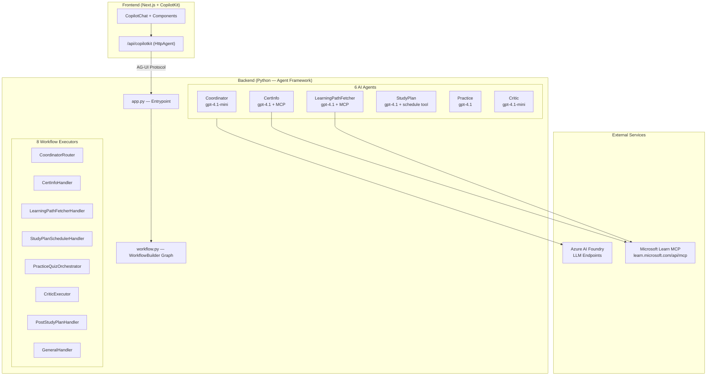

---

## Workflow Graph Topology

The workflow is a directed graph built with `WorkflowBuilder`. The **CoordinatorRouter** is the start node; it classifies user intent and emits a typed `RoutingDecision` that switch-case edges route to specialist handlers.

### MAF-Generated Workflow Diagram

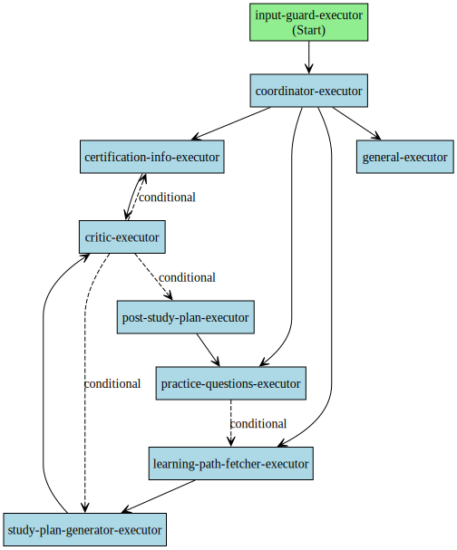

### Detailed Routing Diagram

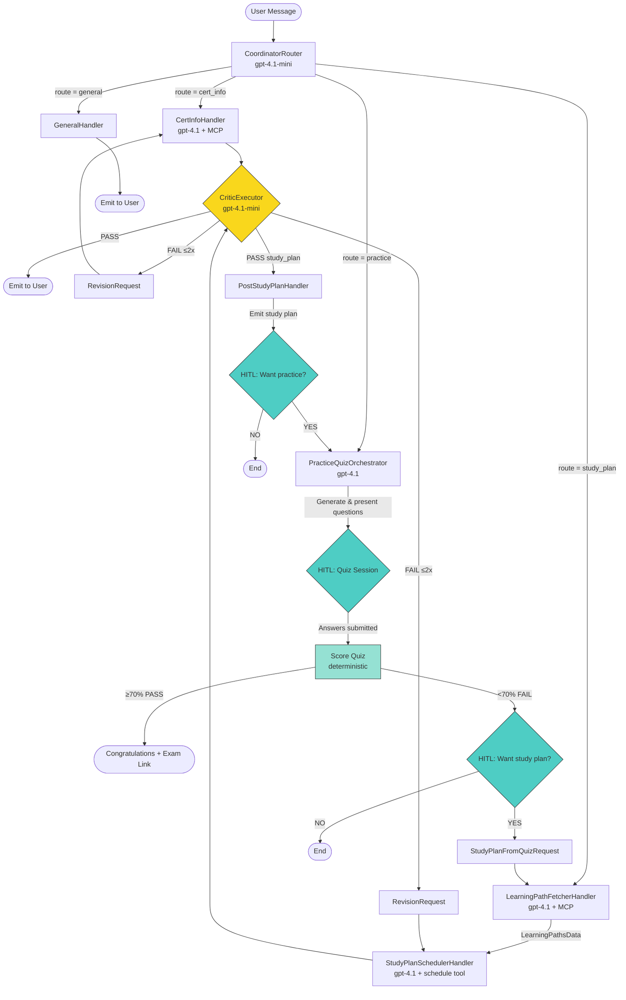

### Cross-Route Flows

The architecture supports **bidirectional routing** between study plan and practice features:

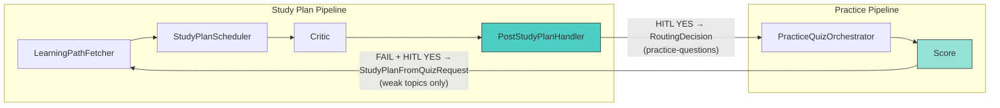

- **Practice → Study Plan**: When a student fails a quiz and accepts the study plan offer, a `StudyPlanFromQuizRequest` routes to the `LearningPathFetcherHandler`, entering the full study plan pipeline with topic data scoped to weak areas.
- **Study Plan → Practice**: After a study plan passes critic review, `PostStudyPlanHandler` asks via HITL if the student wants practice questions. On acceptance, a `RoutingDecision` routes to `PracticeQuizOrchestrator`.

---

## Layer Architecture

### 1. Entrypoint — `src/app.py`

| Mode | Description |
|------|-------------|
| **HTTP server** (default) | FastAPI + Uvicorn; used by `agentdev` / AI Toolkit Agent Inspector |
| **AG-UI** | FastAPI with AG-UI endpoint; bridges to CopilotKit frontend |
| **CLI** | Interactive REPL for terminal testing |

Tracing is configured via OpenTelemetry (gRPC port 4317) for the AI Toolkit trace viewer.

### 2. Workflow — `src/workflow.py`

Factory function `build_workflow()` that:
1. Creates all 6 agents (with credentials and tools)
2. Instantiates all 7 executors
3. Wires the graph with `WorkflowBuilder` (switch-case + conditional edges)
4. Returns `(workflow.as_agent(), credential)` for HTTP/CLI serving

**Routing predicates:**

| Predicate | Purpose |
|-----------|---------|
| `_is_route(route)` | Match `RoutingDecision` by route field |
| `_revision_for(executor_id)` | Match `RevisionRequest` by source executor |
| `_is_approved_study_plan` | Match `ApprovedStudyPlanOutput` for post-study-plan HITL |
| `_is_study_plan_from_quiz` | Match `StudyPlanFromQuizRequest` for post-quiz routing |

### 3. Executors — `src/executors/`

Executors are stateless workflow nodes that receive typed messages, call agents or tools, and emit typed messages downstream. They use `@handler` for typed dispatch and `@response_handler` for HITL replies.

| Executor | ID | Input(s) | Output(s) | Description |
|----------|----|----------|-----------|-------------|
| **CoordinatorRouter** | `coordinator-router` | `list[ChatMessage]` | `RoutingDecision` | Intent classification and routing via structured LLM output |
| **CertInfoHandler** | `cert-info-handler` | `RoutingDecision`, `RevisionRequest` | `SpecialistOutput` | Certification info retrieval using MS Learn MCP |
| **LearningPathFetcherHandler** | `learning-path-fetcher` | `RoutingDecision`, `StudyPlanFromQuizRequest` | `LearningPathsData` | Fetches exam topics, weights, and learning paths from MS Learn MCP |
| **StudyPlanSchedulerHandler** | `study-plan-scheduler` | `LearningPathsData`, `RevisionRequest` | `SpecialistOutput` | Generates week-by-week study plan using deterministic scheduling tool + LLM formatting |
| **CriticExecutor** | `critic-executor` | `SpecialistOutput` | `emit` / `RevisionRequest` / `ApprovedStudyPlanOutput` | Validates specialist output; PASS emits to user (or forwards study plans to `PostStudyPlanHandler`), FAIL sends revision request. Max 2 iterations, then auto-approves. |
| **PostStudyPlanHandler** | `post-study-plan-handler` | `ApprovedStudyPlanOutput` | `RoutingDecision` (to practice) or end | HITL: emits study plan, offers practice questions |
| **PracticeQuizOrchestrator** | `practice-handler` | `RoutingDecision` | `StudyPlanFromQuizRequest` or end | HITL quiz loop: generates questions upfront, presents one-by-one, scores deterministically, generates feedback report, offers study plan on failure |
| **GeneralHandler** | `general-handler` | `RoutingDecision` | emit | Echoes coordinator's direct response for general queries |

### 4. Agents — `src/agents/`

Each agent is an `AzureAIClient`-backed chat agent with specific instructions and optional tools. Created by factory functions in respective modules.

| Agent | Model | Tools | Purpose |
|-------|-------|-------|---------|
| **Coordinator** | `gpt-4.1-mini` | — | Intent classification → structured `CoordinatorResponse` |
| **CertInfo** | `gpt-4.1` | MS Learn MCP | Certification information retrieval |
| **LearningPathFetcher** | `gpt-4.1` | MS Learn MCP | Structured topic/learning-path extraction |
| **StudyPlan** | `gpt-4.1` | `schedule_study_plan` | Study plan formatting (scheduling is deterministic) |
| **Practice** | `gpt-4.1` | — | Mode 1: JSON question generation. Mode 2: Markdown feedback reports |
| **Critic** | `gpt-4.1-mini` | — | Content validation → `CriticVerdictResponse` |

### 5. Data Models — `src/executors/models.py`

All inter-executor messages are typed Pydantic models or dataclasses.

#### Routing & Coordination

| Model | Flow | Description |
|-------|------|-------------|
| `RoutingDecision` | Coordinator → switch-case | Route, task, certification, context, optional response |
| `CoordinatorResponse` | LLM → Coordinator | Strict `response_format` schema |

#### Specialist Pipeline

| Model | Flow | Description |
|-------|------|-------------|
| `SpecialistOutput` | Specialist → Critic | Content + metadata for validation |
| `LearningPathsData` | Fetcher → StudyPlanScheduler | Topics array + original routing decision |
| `RevisionRequest` | Critic → Specialist | FAIL feedback + iteration counter |
| `ApprovedStudyPlanOutput` | Critic → PostStudyPlanHandler | Approved study plan for HITL offer |

#### Learning Path Schemas

| Model | Description |
|-------|-------------|
| `LearningPathFetcherResponse` | Structured response schema for the fetcher agent |
| `LearningPathTopic` | Topic name, weight, and learning paths |
| `LearningPathItem` | Single MS Learn path (name, URL, duration) |

#### Practice Quiz

| Model | Description |
|-------|-------------|
| `PracticeQuestion` | Single MC question (text, options A-D, answer, explanation, topic, difficulty) |
| `QuizState` | Full quiz lifecycle state (questions, answers, index, status) |
| `StudyPlanFromQuizRequest` | Post-quiz → study plan routing (certification, weak topics, score) |

#### Critic

| Model | Description |
|-------|-------------|
| `CriticVerdict` | Parsed verdict with confidence and feedback |
| `CriticVerdictResponse` | Strict `response_format` schema for the critic LLM |

#### HITL Payloads (dataclasses)

| Dataclass | Used by | Purpose |
|-----------|---------|---------|
| `QuizQuestionRequest` | `PracticeQuizOrchestrator` | Present a quiz question |
| `PostQuizStudyPlanOffer` | `PracticeQuizOrchestrator` | Offer study plan after failed quiz |
| `PostStudyPlanPracticeOffer` | `PostStudyPlanHandler` | Offer practice questions after study plan |

### 6. Tools — `src/tools/`

| Tool | Type | Used by | Description |
|------|------|---------|-------------|
| **MS Learn MCP** | `MCPStreamableHTTPTool` | CertInfo, LearningPathFetcher agents | Queries `learn.microsoft.com/api/mcp` for documentation |
| **`score_quiz`** | Python function | PracticeQuizOrchestrator | Deterministic quiz scoring: overall %, per-topic breakdown, weak topics (<70%) |
| **`schedule_study_plan`** | `@ai_function` | StudyPlan agent | Computes week-by-week study schedule from topics JSON + constraints |

### 7. Configuration — `src/config.py`

Centralised configuration loaded from environment variables with multi-provider LLM support.

| Variable | Env Var | Default | Description |
|----------|---------|---------|-------------|
| `LLM_PROVIDER` | `LLM_PROVIDER` | `"azure"` | LLM backend: `azure`, `github`, or `local` |
| `LLM_ENDPOINT` | `LLM_ENDPOINT` | Provider-dependent | Azure AI Foundry endpoint or GitHub Models inferencing URL |
| `LLM_MODEL_DEFAULT` | `LLM_MODEL_DEFAULT` | Per-provider | Default model for all agents (e.g., `gpt-4.1`, `openai/gpt-4o`, `qwen2.5-14b`) |
| `LLM_MODEL_COORDINATOR` | `LLM_MODEL_COORDINATOR` | `LLM_MODEL_DEFAULT` | Per-agent model override |
| `LLM_MODEL_CERTIFICATION_INFO` | `LLM_MODEL_CERTIFICATION_INFO` | `LLM_MODEL_DEFAULT` | Per-agent model override |
| `LLM_MODEL_CRITIC` | `LLM_MODEL_CRITIC` | `LLM_MODEL_DEFAULT` | Per-agent model override |
| `LLM_MODEL_LEARNING_PATH_FETCHER` | `LLM_MODEL_LEARNING_PATH_FETCHER` | `LLM_MODEL_DEFAULT` | Per-agent model override |
| `LLM_MODEL_PRACTICE_QUESTIONS` | `LLM_MODEL_PRACTICE_QUESTIONS` | `LLM_MODEL_DEFAULT` | Per-agent model override |
| `LLM_MODEL_STUDY_PLAN_GENERATOR` | `LLM_MODEL_STUDY_PLAN_GENERATOR` | `LLM_MODEL_DEFAULT` | Per-agent model override |
| `DEFAULT_PRACTICE_QUESTIONS` | `DEFAULT_PRACTICE_QUESTIONS` | `10` | Default quiz size |
| `GENERATE_WORKFLOW_VISUALIZATION` | `GENERATE_WORKFLOW_VISUALIZATION` | `false` | Generate Mermaid + SVG on startup |
| `AGUI_HOST` | `AGUI_HOST` | `127.0.0.1` | AG-UI server bind host |
| `AGUI_PORT` | `AGUI_PORT` | `8000` | AG-UI server bind port |
| `GITHUB_TOKEN` | `GITHUB_TOKEN` | `""` | Required when `LLM_PROVIDER=github` |

**Multi-provider support:**

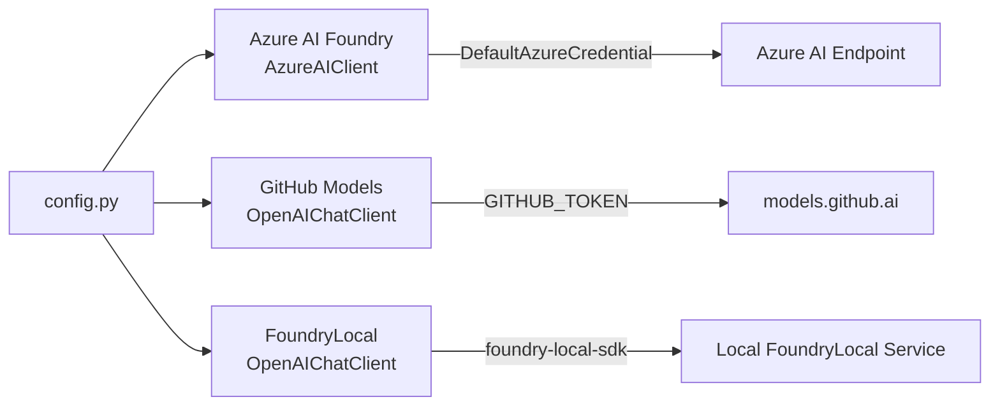

### 8. Frontend — `frontend/`

Next.js + CopilotKit application. The API route (`app/api/copilotkit/route.ts`) bridges CopilotKit requests to the backend via AG-UI protocol using `HttpAgent`.

| Env Var | Default | Description |
|---------|---------|-------------|
| `CERTINATOR_AGENT_URL` / `AGENT_URL` | `http://127.0.0.1:8000/` | Backend agent HTTP endpoint |

### CopilotKit v2 Integration (Frontend ↔ Backend Glue)

The frontend uses CopilotKit v2 hooks to bridge the MAF backend with a rich React UI. The AG-UI protocol is the transport layer between CopilotKit and the Agent Framework HTTP server.

| CopilotKit v2 Feature | Hook / Component | Purpose |
|--------------------|-----------------|---------|
| **Human-in-the-Loop** | `useHumanInTheLoop("request_info")` | Single dispatch hook — routes by `data.type` to `QuizSession`, `OfferCard` (study plan offer), or `OfferCard` (practice offer) |
| **Shared State (Read)** | `useAgent` | Reads `active_quiz_state` and `workflow_progress` from the backend's shared state |
| **Tool Renderer** | `useRenderTool("update_workflow_progress")` | Renders `WorkflowProgress` inline in the chat — one row per backend step |
| **Tool Renderer** | `useRenderTool("update_active_quiz_state")` | Renders `QuizDashboard` inline when quiz completes |
| **Agent Context** | `useAgentContext` | Exposes user preferences (difficulty, question count, locale) as context the backend agent can use |
| **Suggestions** | `useConfigureSuggestions` | Static suggestions: AZ-104 overview, AI-900 study plan, AI-102 practice quiz |

**Component mapping:**

| Component | CopilotKit Hook | Renders |
|-----------|----------------|---------|
| `CertinatorHooks` | All hooks above | Invisible — registers all hooks inside the CopilotKit provider |
| `QuizSession` | `useHumanInTheLoop` | Full quiz UI: progress bar, question navigator, A/B/C/D buttons, submit |
| `QuizCard` | (Used by QuizSession) | Individual question card with clickable answer options |
| `OfferCard` | `useHumanInTheLoop` | Yes/No decision card for study plan and practice offers |
| `QuizDashboard` | `useAgent` + `useRenderTool` | Post-quiz summary: score, per-topic breakdown, question-by-question results |
| `WorkflowProgress` | `useRenderTool` | Step-by-step workflow progress with spinner and reasoning |
| `SlowRunIndicator` | `useAgent` (isRunning) | Warning indicator shown after 30s of active agent run |

---

## Frontend Architecture

### Component Architecture

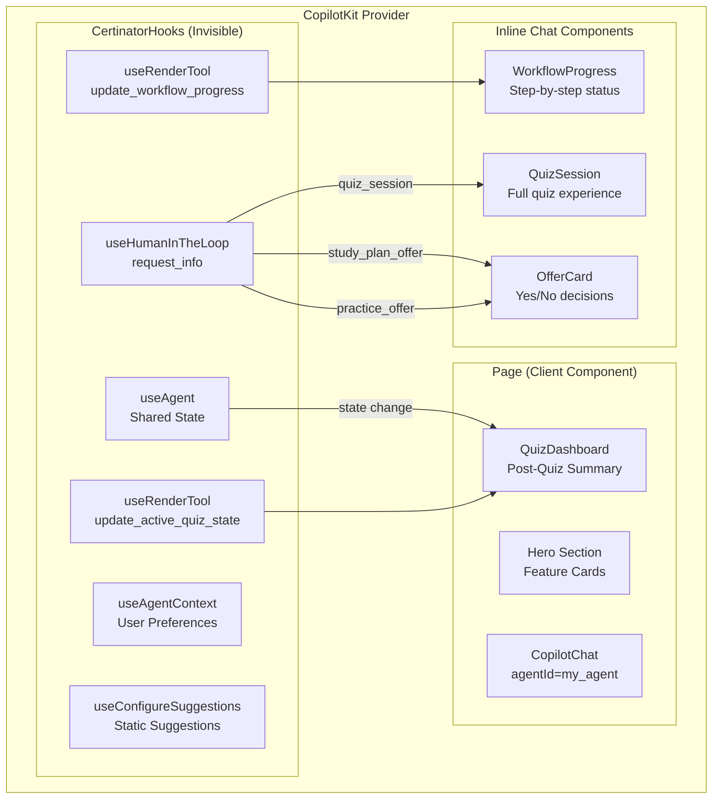

### AG-UI Protocol Bridge

The backend uses synthetic tool calls to push state updates to the frontend:

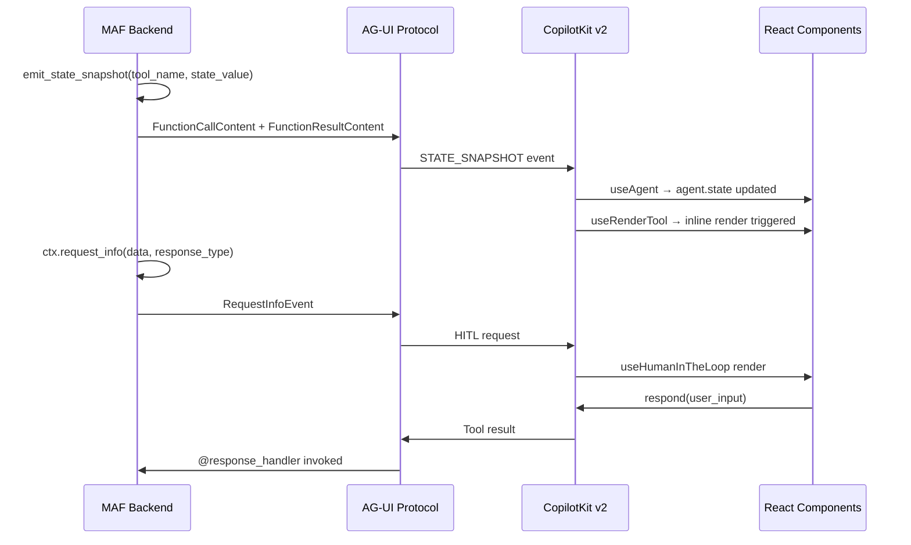

### predict_state_config Mapping

| State Key | Synthetic Tool Name | Tool Argument | Description |
|-----------|-------------------|---------------|-------------|
| `workflow_progress` | `update_workflow_progress` | `progress` | Current workflow step progress |
| `active_quiz_state` | `update_active_quiz_state` | `quiz_state` | Active quiz session state |
| `post_study_plan_context` | `update_post_study_plan_context` | `context` | Post-study-plan context for HITL |

### HITL Dispatch Pattern

MAF's `WorkflowAgent` emits all HITL interactions with tool name `request_info`. The frontend registers a single `useHumanInTheLoop("request_info")` hook that dispatches to the correct component based on `data.type`:

| `data.type` | Component | Interaction |
|-------------|-----------|-------------|
| `quiz_session` | `QuizSession` | Full quiz with progress bar, question navigator, A/B/C/D buttons |
| `study_plan_offer` | `OfferCard` | "Create study plan" / "Maybe later" after failed quiz |
| `practice_offer` | `OfferCard` | "Start practice" / "Not now" after study plan delivery |

---

## HITL (Human-in-the-Loop) Pattern

The system uses the MAF HITL pattern for interactive features:

1. An executor calls `ctx.request_info(request_data=<payload>, response_type=str)`
2. The workflow pauses and emits a `RequestInfoEvent` to the client
3. The client collects the user's response
4. The client calls `send_responses_streaming({request_id: response})`
5. The `@response_handler` decorated method receives the original request + response
6. The executor continues processing (present next question, route to another handler, or end)

**HITL points in the system:**

| Executor | HITL Action | User Input | Frontend Component |
|----------|-------------|------------|-------------------|
| `PracticeQuizOrchestrator` | Present quiz question | A/B/C/D answer | `QuizCard` |
| `PracticeQuizOrchestrator` | Offer study plan after failed quiz | yes/no | `OfferCard` |
| `PostStudyPlanHandler` | Offer practice after study plan | yes/no | `OfferCard` |

---

## Critic Validation Loop

All specialist outputs (except practice quizzes, which are self-contained) pass through `CriticExecutor`:

1. Specialist handler emits `SpecialistOutput`
2. Critic agent validates content against quality criteria
3. **PASS** → output emitted to user (or forwarded to `PostStudyPlanHandler` for study plans)
4. **FAIL** → `RevisionRequest` sent back to source handler (conditional edges route by `source_executor_id`)
5. Max iterations: **2** — auto-approves with disclaimer after cap

---

## Deployment Architecture

### Current Development Setup

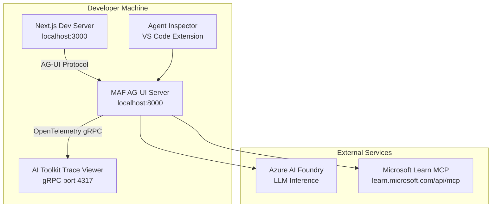

### Run Modes

| Mode | Command | Description |
|------|---------|-------------|
| **AG-UI** (default) | `python src/app.py --agui` | FastAPI AG-UI endpoint for CopilotKit frontend |
| **HTTP server** | `python src/app.py` | FastAPI + Uvicorn for Agent Inspector |
| **CLI** | `python src/app.py --cli` | Interactive REPL for terminal testing |

### Thread Persistence

Conversation threads are currently stored in an in-memory dictionary (`_thread_store`). Threads persist across requests within the same server process but are lost on restart.

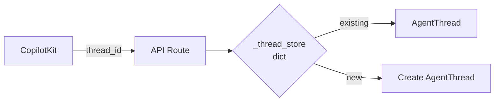

### Custom Orchestrator Chain

The AG-UI integration uses a custom orchestrator chain to handle MAF's HITL pattern:

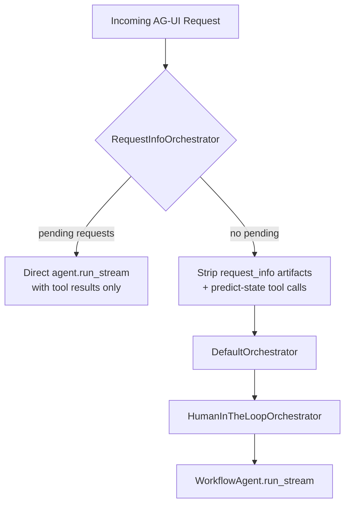

---

## File Structure

```
src/
├── app.py                          # Entrypoint (HTTP / AG-UI / CLI)
├── config.py                       # Environment configuration (multi-provider)
├── metrics.py                      # Custom OpenTelemetry metrics
├── workflow.py                     # Workflow graph builder
├── agents/
│   ├── __init__.py                 # Re-exports all agent factories
│   ├── coordinator_agent.py        # Intent classification (gpt-4.1-mini)
│   ├── certification_info_agent.py # Certification info (gpt-4.1 + MCP)
│   ├── learning_path_fetcher_agent.py  # Topic extraction (gpt-4.1 + MCP)
│   ├── study_plan_generator_agent.py   # Study plan formatting (gpt-4.1)
│   ├── practice_questions_agent.py # Question gen + feedback (gpt-4.1)
│   └── critic_agent.py            # Quality validation (gpt-4.1-mini)
├── executors/
│   ├── __init__.py                 # Shared helpers (emit_response, safe_agent_run, etc.)
│   ├── models.py                   # All typed data models (Pydantic)
│   ├── coordinator_executor.py     # CoordinatorRouter
│   ├── certification_info_executor.py  # CertInfoHandler
│   ├── learning_path_fetcher_executor.py # LearningPathFetcherHandler
│   ├── study_plan_generator_executor.py  # StudyPlanSchedulerHandler
│   ├── critic_executor.py          # CriticExecutor
│   ├── post_study_plan_executor.py # PostStudyPlanHandler (HITL)
│   └── practice_questions_executor.py  # PracticeQuizOrchestrator (HITL)
├── tools/
│   ├── __init__.py
│   ├── mcp.py                      # MS Learn MCP tool factory + is_mcp_error
│   ├── practice.py                 # Deterministic quiz scoring + validation
│   └── schedule.py                 # Study plan scheduling (@ai_function)
├── utils/
│   └── delete_foundry_agents.py    # Utility for cleaning up Foundry agents
frontend/
├── app/
│   ├── page.tsx                    # Main UI — hero, quiz dashboard, CopilotChat
│   ├── layout.tsx                  # Root layout — CopilotKit provider, dark theme
│   ├── types.ts                    # Shared TS types (mirrors models.py)
│   ├── globals.css                 # Global styles (quiz cards, offer cards, etc.)
│   ├── components/
│   │   ├── CertinatorHooks.tsx     # All CopilotKit v2 hook registrations
│   │   ├── CopilotKitProvider.tsx  # CopilotKit provider configuration
│   │   ├── QuizSession.tsx         # Full quiz UI (progress, navigator, options)
│   │   ├── QuizCard.tsx            # Individual quiz question card
│   │   ├── OfferCard.tsx           # HITL yes/no offer card
│   │   ├── QuizDashboard.tsx       # Post-quiz summary panel
│   │   ├── WorkflowProgress.tsx    # Step-by-step workflow status in chat
│   │   ├── WorkflowProgressContext.tsx # React context for workflow progress
│   │   ├── SlowRunIndicator.tsx    # Warning after 30s active run
│   │   └── ErrorBoundary.tsx       # React error boundary
│   └── api/copilotkit/route.ts     # CopilotKit → Agent Framework bridge
├── patches/
│   └── @copilotkitnext__react@1.52.0-next.8.patch  # SDK patch
└── public/                         # Static assets
```

---

## Design Principles

1. **Typed message passing**: All inter-executor data flows through Pydantic models — no raw strings or dicts at boundaries.
2. **Deterministic where possible**: Scoring (`score_quiz`) and scheduling (`schedule_study_plan`) are Python functions — LLMs never do arithmetic.
3. **LLMs for language**: Agents handle classification, generation, and formatting — tasks where language understanding adds value.
4. **Single-responsibility executors**: Each executor owns one concern; new features add new executors rather than growing existing ones.
5. **Critic gate**: Specialist outputs pass through quality validation before reaching the user, with bounded revision loops.
6. **HITL for decisions**: Workflow pauses for meaningful student choices (answers, study plan acceptance) using the MAF `request_info`/`response_handler` pattern.
7. **Reusable agents**: The same agent instance (e.g., `learning_path_agent`) can be shared across multiple executors that need topic data.

---

## Reasoning Patterns

The system implements several well-established reasoning patterns to improve robustness, transparency, and quality of outputs.

### 1. Planner–Executor Pattern

The **Coordinator** (gpt-4.1-mini) acts as the planner — classifying user intent via structured output (`CoordinatorResponse`) and emitting a `RoutingDecision`. Specialist executors act as executors that carry out domain-specific tasks. The routing is **deterministic** once the Coordinator emits its decision — the `WorkflowBuilder` graph topology handles all downstream orchestration.

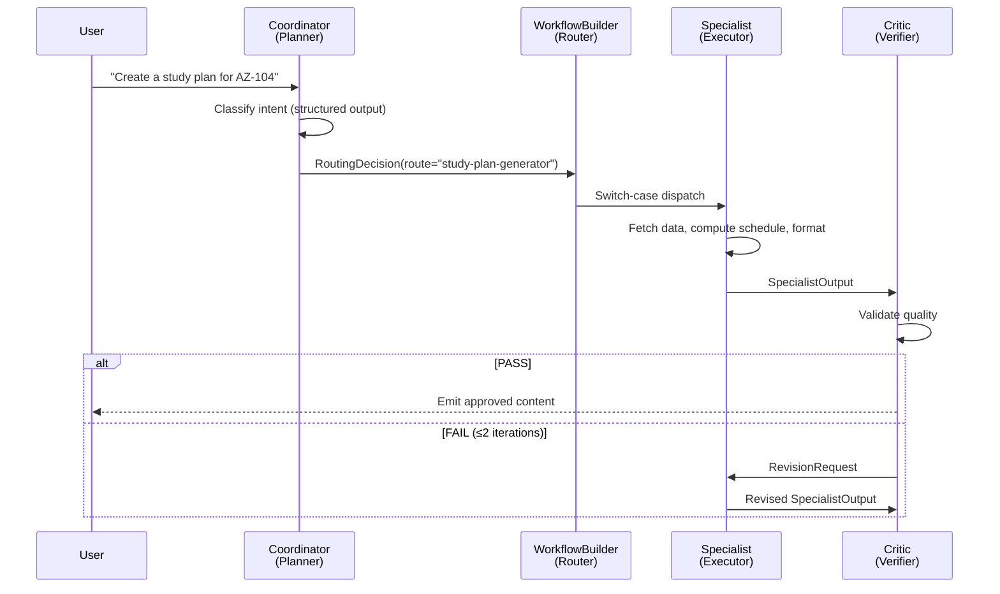

**Design choice**: The Coordinator uses `gpt-4.1-mini` because routing is a classification task that doesn't need a large model. Specialists use `gpt-4.1` where generation capability matters.

### 2. Critic / Verifier Pattern

A shared `CriticExecutor` validates all specialist outputs (except practice quizzes, which use deterministic scoring) before they reach the user:

- **Structured verdict**: The Critic agent outputs `CriticVerdictResponse` with `PASS`/`FAIL`, confidence score, identified issues, and improvement suggestions.
- **Bounded iteration**: Maximum **2 revision attempts**, then auto-approves with a visible disclaimer. This prevents infinite token-burning loops.
- **Content-type routing**: Study plans receive special handling — approved plans route to `PostStudyPlanHandler` for the HITL practice offer, while other content emits directly to the user.

### 3. Self-Reflection & Iteration

The **critic revision loop** implements self-reflection: when content fails validation, the Critic provides detailed feedback that the specialist uses to revise its output. The revision request carries:

- `previous_content` — what was rejected
- `feedback[]` — specific issues identified
- `iteration` counter — so the specialist knows how many attempts remain

### 4. Role-Based Specialization

Each of the 6 agents has a distinct instruction set, model, and tool set — there is no overlap in responsibilities:

| Agent | Role | Model | Tools | Why Separate |
|-------|------|-------|-------|-------------|
| **Coordinator** | Intent classification | gpt-4.1-mini | — | Routing is cheap classification; doesn't need a powerful model |
| **CertInfo** | Info retrieval | gpt-4.1 | MCP | Needs MCP tool and detailed retrieval instructions |
| **LearningPathFetcher** | Structured extraction | gpt-4.1 | MCP | Schema-constrained output contract differs from CertInfo |
| **StudyPlan** | Formatting | gpt-4.1 | schedule | Math offloaded to tool; LLM does prose only |
| **Practice** | Dual-mode generation | gpt-4.1 | — | Question gen and feedback reports are distinct prompts |
| **Critic** | Validation | gpt-4.1-mini | — | Review is less demanding than generation |

### 5. Deterministic Computation

Critical calculations are **never delegated to LLMs** — they use deterministic Python functions:

| Computation | Tool | Description |
|-------------|------|-------------|
| Quiz scoring | `score_quiz()` | Overall %, per-topic breakdown, weak topic identification |
| Study scheduling | `schedule_study_plan()` | Week-by-week schedule from topics, hours/week, duration |

The `StudyPlanGeneratorExecutor` calls `schedule_study_plan()` **directly as Python** (not via agent tool call) to guarantee arithmetic correctness, then sends the computed schedule to the LLM purely for Markdown formatting. If the LLM returns JSON instead of prose, a deterministic Markdown renderer acts as a fallback.

---

## Custom OTel Metrics

All custom metrics are defined in `src/metrics.py` as module-level singletons, created via the OpenTelemetry `metrics.get_meter("certinator_ai", "1.0.0")` API. Instruments are created once and reused across executors.

### Metrics Catalog

| Metric | Type | Attributes | Emitted by |
|--------|------|-----------|------------|
| `certinator.critic.verdicts` | Counter | `verdict`, `content_type`, `auto_approved` | `CriticExecutor` — on every PASS/FAIL verdict |
| `certinator.coordinator.routing_decisions` | Counter | `route` | `CoordinatorExecutor` — on every routing decision |
| `certinator.quiz.score_pct` | Histogram | `certification` | `PracticeQuestionsExecutor` — overall quiz score (0–100) |
| `certinator.quiz.topic_score_pct` | Histogram | `topic`, `certification` | `PracticeQuestionsExecutor` — per-topic score (0–100) |
| `certinator.hitl.study_plan_offers` | Counter | `accepted` | `PracticeQuestionsExecutor` — post-quiz study plan offer responses |
| `certinator.hitl.practice_offers` | Counter | `accepted` | `PostStudyPlanExecutor` — post-study-plan practice offer responses |
| `certinator.mcp.calls` | Counter | `executor`, `status` | `CertInfoExecutor`, `LearningPathFetcherExecutor` — MCP call outcomes |
| `certinator.mcp.unavailable_events` | Counter | `executor`, `degraded` | `CertInfoExecutor`, `LearningPathFetcherExecutor` — MCP unavailability triggers |

### Metrics Flow

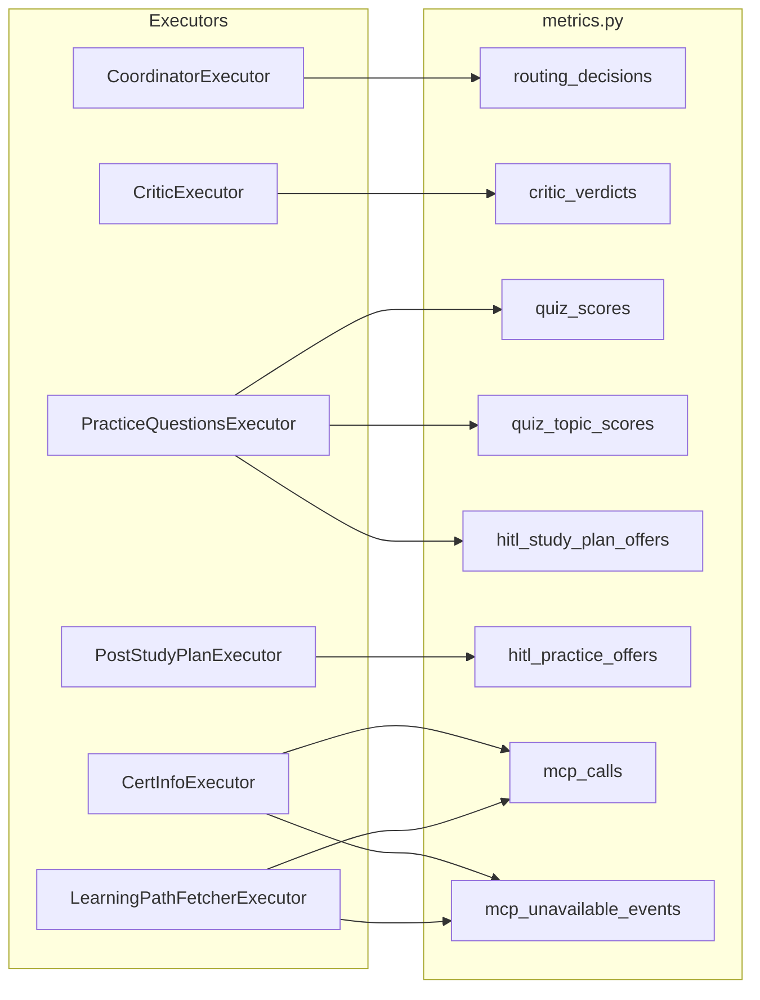

---

## Evaluations & Telemetry

### Current Observability

| Layer | Technology | Description |
|-------|-----------|-------------|
| **Distributed tracing** | OpenTelemetry (gRPC port 4317) | Sends traces to AI Toolkit trace viewer in VS Code via `configure_otel_providers()` |
| **Workflow visualization** | `WorkflowViz` | Generates Mermaid diagrams, DiGraph, and SVG exports of the workflow graph on build |
| **Workflow progress** | Synthetic state snapshots | Real-time step-by-step progress sent to frontend via `update_workflow_progress` |

### Evaluation Strategy

#### Offline Evaluations (CI/CD)

| Evaluation | Metric | Method |
|------------|--------|--------|
| **Routing accuracy** | % correct routes | Labeled dataset (~100 queries) run against Coordinator in isolation |
| **CertInfo completeness** | Rubric score (0-5) | Azure AI Evaluation `RelevanceEvaluator` against known-good outputs |
| **StudyPlan feasibility** | Hours add up, weeks ≤ deadline, all topics covered | Deterministic assertions on `schedule_study_plan()` output |
| **Practice question quality** | Answer-key accuracy, topic coverage, difficulty distribution | `SimilarityEvaluator` against reference question sets |
| **Critic effectiveness** | False positive/negative rates | Known-good + known-bad outputs, measured verdict accuracy |

#### Online Telemetry (Production)

| Metric | How to Capture |
|--------|---------------|
| Critic revision rate | Custom OTel metrics on PASS/FAIL verdicts |
| HITL acceptance rate | Log accept/reject ratios for offers |
| Quiz completion rate | Starts vs. completions |
| Token usage per route | Per-agent token count spans |
| MCP latency & failure rate | Dedicated spans with success/failure status |

---

## Responsible AI

### Implemented Guardrails

| Guardrail | Description |
|-----------|-------------|
| **Critic validation** | All specialist outputs reviewed for quality before delivery |
| **Structured output** | `response_format` prevents free-form hallucination in routing and validation |
| **Deterministic scoring** | LLMs never perform arithmetic — Python functions handle all calculations |
| **MCP-first instructions** | Agents instructed to always use MCP, never answer from memory alone |
| **Auto-approve disclaimer** | When critic loop reaches iteration cap, content is delivered with a transparent disclaimer about verification needs |
| **Bounded revision loops** | Maximum 2 critic iterations prevents infinite token consumption |
| **MCP error handling** | `CertificationInfoExecutor` logs MCP failures, increments `mcp_unavailable_events` metric, and returns a user-friendly error message |
| **Transient error retry** | `safe_agent_run()` with exponential backoff (max 5 attempts) for timeout, rate limit, and network errors |
| **Question validation** | `validate_questions()` deterministically checks practice questions for structural integrity, topic coverage, and deduplication before delivery |

### Additional Considerations

| Area | Approach |
|------|----------|
| **Input validation** | Azure AI Prompt Shields for jailbreak/prompt injection detection at the Coordinator entry point |
| **Output content safety** | Azure AI Content Safety for text analysis (hate, self-harm, sexual, violence categories) |
| **PII protection** | Detection and redaction on user input before logging to traces |
| **Groundedness** | `GroundednessEvaluator` to verify CertInfo output is grounded in MCP search results |
| **Rate limiting** | Per-session rate limiting at the FastAPI layer |
| **MCP error handling** | MCP failures are counted and surfaced with a user-friendly error message |
| **Transparency** | Citation tracking — preserve source URLs from MCP tool calls in final output |

---