# Certinator AI — System Architecture

Multi-agent workflow system for Microsoft certification exam preparation, built on **Microsoft Agent Framework (MAF)** with a graph-based workflow engine, HITL (human-in-the-loop) interactions, and critic-validated outputs.

> **Design philosophy — "Trust but verify":** LLMs handle language tasks (classification, generation, formatting), while all computation is deterministic Python. A critic layer validates every specialist output, and the critic itself is evaluated with precision/recall metrics. Reliability comes from architecture, not prompt engineering.

---

## Table of Contents

- [High-Level Overview](#high-level-overview)
- [Workflow Graph Topology](#workflow-graph-topology)
- [Layer Architecture](#layer-architecture)
- [Frontend Architecture](#frontend-architecture)
- [Reasoning Patterns](#reasoning-patterns)
- [HITL (Human-in-the-Loop) Pattern](#hitl-human-in-the-loop-pattern)
- [Critic Validation Loop](#critic-validation-loop)
- [Custom OTel Metrics](#custom-otel-metrics)
- [Evaluations & Telemetry](#evaluations--telemetry)
- [Responsible AI](#responsible-ai)
- [Deployment Architecture](#deployment-architecture)
- [File Structure](#file-structure)
- [Design Principles](#design-principles)

---

## High-Level Overview

```
┌──────────────────────────────────────────────────────────────────┐
│  Frontend (Next.js + CopilotKit v2)                              │
│    └── POST /api/copilotkit → HttpAgent → Agent Framework HTTP   │
└──────────────────────────────────────────────────────────────────┘
                              │
                    HTTP / AG-UI Protocol
                              │
┌──────────────────────────────────────────────────────────────────┐
│  Backend (Python — Microsoft Agent Framework)                    │
│                                                                  │
│    app.py  →  workflow.py  →  WorkflowBuilder graph              │
│             (6 agents, 9 executors, graph-based routing)         │
│                                                                  │
│    Run mode: AG-UI (FastAPI + Uvicorn)                           │
└──────────────────────────────────────────────────────────────────┘
                              │
                   Azure AI Foundry (LLMs)
                   Microsoft Learn MCP (docs)
                   Microsoft Learn Catalog API
```

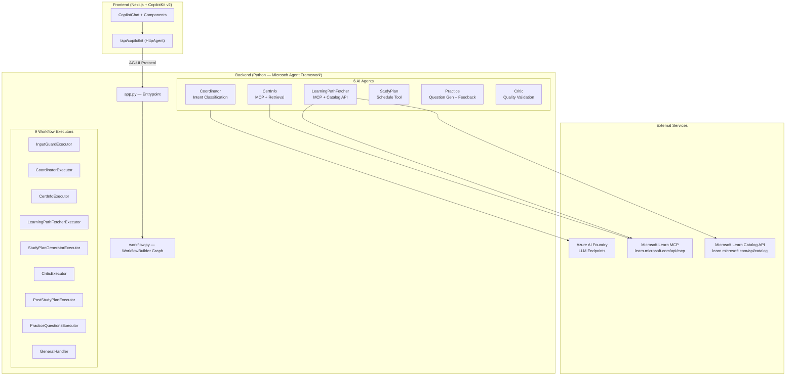

---

## Workflow Graph Topology

The workflow is a directed graph built with `WorkflowBuilder`. The **InputGuardExecutor** is the start node — it validates user input for safety before any LLM call. The **CoordinatorExecutor** classifies user intent and emits a typed `RoutingDecision` that switch-case edges route to specialist handlers.

### MAF-Generated Workflow Diagram


### Detailed Routing Diagram

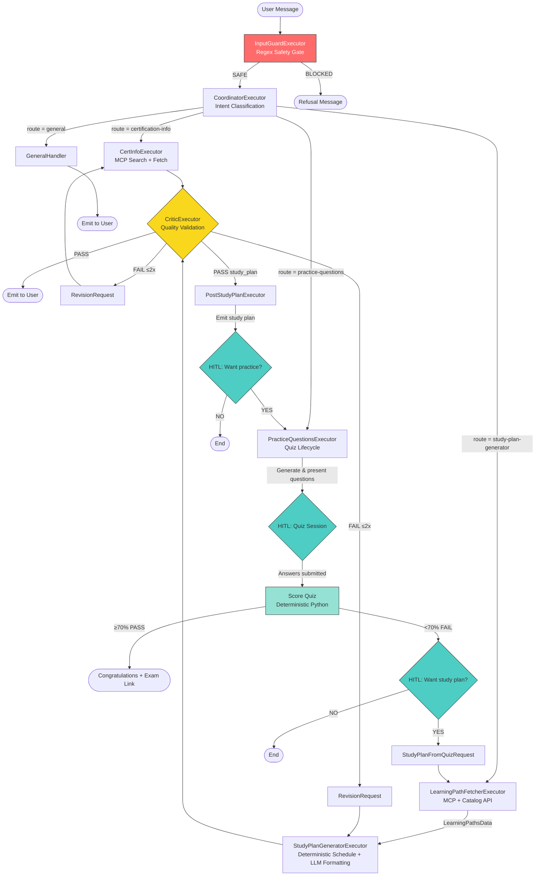

### Cross-Route Flows

The architecture supports **bidirectional routing** between study plan and practice features, creating a closed learning loop:

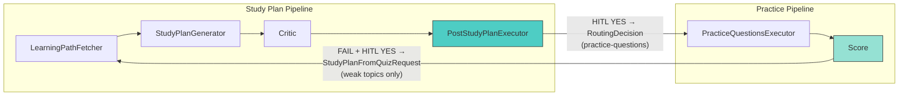

- **Practice → Study Plan**: When a student fails a quiz (<70%) and accepts the study plan offer, a `StudyPlanFromQuizRequest` routes to `LearningPathFetcherExecutor`, entering the full study plan pipeline scoped to weak topics only.
- **Study Plan → Practice**: After a study plan passes critic review, `PostStudyPlanExecutor` asks via HITL if the student wants practice questions. On acceptance, a `RoutingDecision` routes to `PracticeQuestionsExecutor`.

---

## Layer Architecture

### 1. Entrypoint — `src/app.py`

FastAPI + Uvicorn server with AG-UI endpoint for CopilotKit frontend integration.

- Configures logging, loads `.env`, sets up OpenTelemetry (gRPC port 4317)
- Builds the workflow graph and wraps it as an `AgentFrameworkAgent`
- Configures custom orchestrator chain for HITL and state synchronization
- Registers `RateLimiterMiddleware` and health endpoints

Tracing is configured via OpenTelemetry for Aspire Dashboard the AI Toolkit trace viewer in VS Code.

### 2. Workflow — `src/workflow.py`

Factory function `build_workflow()` that:
1. Creates all 6 agents (with credentials and tools)
2. Instantiates all 9 executors (8 class-based + 1 function-based)
3. Wires the graph with `WorkflowBuilder` (switch-case + conditional edges)
4. Returns `(workflow.as_agent(), credential)` for HTTP serving

**Routing predicates:**

| Predicate | Purpose |
|-----------|---------|
| `_is_route(route)` | Match `RoutingDecision` by route field |
| `_revision_for(executor_id)` | Match `RevisionRequest` by source executor |
| `_is_approved_study_plan` | Match `ApprovedStudyPlanOutput` for post-study-plan HITL |
| `_is_study_plan_from_quiz` | Match `StudyPlanFromQuizRequest` for post-quiz routing |

### 3. Executors — `src/executors/`

Executors are stateless workflow nodes that receive typed messages, call agents or tools, and emit typed messages downstream. They use `@handler` for typed dispatch and `@response_handler` for HITL replies.

| Executor | ID | Input(s) | Output(s) | Description |
|----------|----|----------|-----------|-------------|
| **InputGuardExecutor** | `input-guard-executor` | `list[ChatMessage]` | `list[ChatMessage]` or terminal | **Start node.** Regex-based safety gate: prompt injection, content safety, exam policy |
| **CoordinatorExecutor** | `coordinator-executor` | `list[ChatMessage]` | `RoutingDecision` | Intent classification and routing via structured LLM output |
| **CertInfoExecutor** | `certification-info-executor` | `RoutingDecision`, `RevisionRequest` | `SpecialistOutput` | Certification info retrieval using MS Learn MCP |
| **LearningPathFetcherExecutor** | `learning-path-fetcher-executor` | `RoutingDecision`, `StudyPlanFromQuizRequest` | `LearningPathsData` | Fetches exam topics, weights, and learning paths from MCP + Catalog API |
| **StudyPlanGeneratorExecutor** | `study-plan-generator-executor` | `LearningPathsData`, `RevisionRequest` | `SpecialistOutput` | Generates week-by-week study plan using deterministic scheduling + LLM formatting |
| **CriticExecutor** | `critic-executor` | `SpecialistOutput` | `emit` / `RevisionRequest` / `ApprovedStudyPlanOutput` | Validates specialist output; PASS emits to user (or forwards study plans to `PostStudyPlanExecutor`), FAIL sends revision request. Max 2 iterations. |
| **PostStudyPlanExecutor** | `post-study-plan-executor` | `ApprovedStudyPlanOutput` | `RoutingDecision` (to practice) or end | HITL: emits study plan, offers practice questions |
| **PracticeQuestionsExecutor** | `practice-questions-executor` | `RoutingDecision` | `StudyPlanFromQuizRequest` or end | Full quiz lifecycle: generate → present (HITL) → score → feedback → offer study plan |
| **general_handler** | `general-executor` | `RoutingDecision` | emit | Function-based executor (`@executor`) that echoes coordinator's direct response |

### 4. Agents — `src/agents/`

Each agent is created by a factory function and backed by `AzureAIClient` (or `OpenAIChatClient` for GitHub/Local providers). Agents have specific instructions and optional tools.

| Agent | Model Config | Tools | Purpose |
|-------|-------------|-------|---------|
| **CoordinatorAgent** | `LLM_MODEL_COORDINATOR` | — | Intent classification → structured `CoordinatorResponse` with chain-of-thought reasoning |
| **CertInfoAgent** | `LLM_MODEL_CERTIFICATION_INFO` | MS Learn MCP | Certification information retrieval via mandatory MCP search strategy |
| **LearningPathFetcherAgent** | `LLM_MODEL_LEARNING_PATH_FETCHER` | MS Learn MCP, `fetch_exam_learning_paths` | Structured topic/learning-path extraction with JSON output contract |
| **StudyPlanGeneratorAgent** | `LLM_MODEL_STUDY_PLAN_GENERATOR` | `schedule_study_plan` | Study plan **presentation only** — receives pre-computed schedule JSON and converts to Markdown |
| **PracticeQuestionsAgent** | `LLM_MODEL_PRACTICE_QUESTIONS` | — | **Dual-mode**: Mode 1 = JSON question generation; Mode 2 = Markdown feedback report generation |
| **CriticAgent** | `LLM_MODEL_CRITIC` | — | Content validation → `CriticVerdictResponse` (PASS/FAIL, confidence, issues, suggestions) |

All agents receive `SAFETY_SYSTEM_PROMPT` in their instructions as defense-in-depth.

### 5. Data Models — `src/executors/models/`

All inter-executor messages are typed Pydantic models organized into submodules. No raw strings or dicts at boundaries.

#### Routing & Coordination (`models/routing.py`)

| Model | Flow | Description |
|-------|------|-------------|
| `RoutingDecision` | Coordinator → switch-case | Route, task, certification, context, optional response |
| `CoordinatorResponse` | LLM → Coordinator | Strict `response_format` schema with reasoning field |

#### Specialist Pipeline (`models/critic.py`)

| Model | Flow | Description |
|-------|------|-------------|
| `SpecialistOutput` | Specialist → Critic | Content + metadata (content_type, source_executor_id) for validation |
| `CriticVerdict` | Parsed verdict | PASS/FAIL with confidence and feedback |
| `CriticVerdictResponse` | LLM → Critic | Strict `response_format` schema |

#### Learning Paths (`models/learning_paths.py`)

| Model | Description |
|-------|-------------|
| `LearningPathFetcherResponse` | Structured response schema for the fetcher agent |
| `SkillAtAGlance` | Topic name, weight, and associated learning paths |
| `TrainingModule` | Single MS Learn module (name, URL, duration, units) |
| `LearningPath` | Learning path with metadata and child modules |
| `LearningPathsData` | Complete extraction result → StudyPlanGeneratorExecutor |

#### Scheduling (`models/scheduling.py`)

| Model | Description |
|-------|-------------|
| `StudyConstraints` | Hours/week, weeks available, start date (parsed from user text) |
| `ScheduleWeek` | Single week: modules, hours, topic focus |
| `ScheduleResult` | Complete schedule: weekly plan, skill summary, skipped modules, notes |

#### Practice Quiz (`models/practice.py`)

| Model | Description |
|-------|-------------|
| `PracticeQuestion` | Single MC question (text, options A-D, answer, explanation, topic, difficulty) |
| `QuizState` | Full quiz lifecycle state (questions, answers, index, score, status) |

#### Cross-Workflow (`models/cross_workflow.py`)

| Model | Flow | Description |
|-------|------|-------------|
| `RevisionRequest` | Critic → Specialist | FAIL feedback + previous content + iteration counter |
| `ApprovedStudyPlanOutput` | Critic → PostStudyPlanExecutor | Approved study plan for HITL offer |
| `StudyPlanFromQuizRequest` | PracticeQuestionsExecutor → LearningPathFetcher | Post-quiz → study plan routing (certification, weak topics, score) |

### 6. Tools — `src/tools/`

| Tool | Type | Used by | Description |
|------|------|---------|-------------|
| **MS Learn MCP** | `MCPStreamableHTTPTool` | CertInfoAgent, LearningPathFetcherAgent | Queries `learn.microsoft.com/api/mcp` for search + fetch of documentation |
| **`fetch_exam_learning_paths`** | `@ai_function` | LearningPathFetcherAgent | Discovers learning path UIDs from exam course pages, resolves modules via Catalog API. 24h disk cache. |
| **`schedule_study_plan`** | `@ai_function` | StudyPlanGeneratorAgent | Wraps `compute_schedule()` — computes week-by-week study schedule from topics JSON + constraints |
| **`compute_schedule()`** | Python function | StudyPlanGeneratorExecutor (direct call) | Core scheduling engine: flattens modules, selects within time budget, builds weekly calendar |
| **`score_quiz()`** | Python function | PracticeQuestionsExecutor | Deterministic quiz scoring: overall %, per-topic breakdown, weak topic identification (<70%) |
| **`validate_questions()`** | Python function | PracticeQuestionsExecutor | Structural validation of generated questions: count, options A-D, duplicates, topic coverage |
| **`extract_topic_distribution()`** | Python function | PracticeQuestionsExecutor | Extracts topic names and exam weights from learning path responses. Normalizes to sum 100%. |

**Design note:** `StudyPlanGeneratorExecutor` calls `compute_schedule()` **directly as Python** — not via agent tool call — to guarantee arithmetic correctness. The computed schedule JSON is then sent to the LLM purely for Markdown formatting. If the LLM returns JSON instead of prose, a deterministic Markdown renderer acts as a fallback.

### 7. Configuration — `src/config.py`

Centralised configuration loaded from environment variables with multi-provider LLM support and per-agent model overrides.

| Variable | Env Var | Default | Description |
|----------|---------|---------|-------------|
| `LLM_PROVIDER` | `LLM_PROVIDER` | `"azure"` | LLM backend: `azure`, `github`, or `local` |
| `LLM_ENDPOINT` | `LLM_ENDPOINT` | Provider-dependent | Azure AI Foundry endpoint or GitHub Models URL |
| `LLM_MODEL_DEFAULT` | `LLM_MODEL_DEFAULT` | Per-provider | Default model for all agents |
| `LLM_MODEL_COORDINATOR` | `LLM_MODEL_COORDINATOR` | `LLM_MODEL_DEFAULT` | Per-agent model override |
| `LLM_MODEL_CERTIFICATION_INFO` | `LLM_MODEL_CERTIFICATION_INFO` | `LLM_MODEL_DEFAULT` | Per-agent model override |
| `LLM_MODEL_CRITIC` | `LLM_MODEL_CRITIC` | `LLM_MODEL_DEFAULT` | Per-agent model override |
| `LLM_MODEL_LEARNING_PATH_FETCHER` | `LLM_MODEL_LEARNING_PATH_FETCHER` | `LLM_MODEL_DEFAULT` | Per-agent model override |
| `LLM_MODEL_PRACTICE_QUESTIONS` | `LLM_MODEL_PRACTICE_QUESTIONS` | `LLM_MODEL_DEFAULT` | Per-agent model override |
| `LLM_MODEL_STUDY_PLAN_GENERATOR` | `LLM_MODEL_STUDY_PLAN_GENERATOR` | `LLM_MODEL_DEFAULT` | Per-agent model override |
| `DEFAULT_PRACTICE_QUESTIONS` | `DEFAULT_PRACTICE_QUESTIONS` | `10` | Default quiz size |
| `RATE_LIMIT_ENABLED` | `RATE_LIMIT_ENABLED` | `true` | Enable/disable rate limiting |
| `RATE_LIMIT_PER_SESSION` | `RATE_LIMIT_PER_SESSION` | `20` | Requests per session per 60s window |
| `RATE_LIMIT_PER_IP` | `RATE_LIMIT_PER_IP` | `60` | Requests per IP per 60s window |
| `AGUI_HOST` | `AGUI_HOST` | `127.0.0.1` | AG-UI server bind host |
| `AGUI_PORT` | `AGUI_PORT` | `8000` | AG-UI server bind port |

**Multi-provider support:**

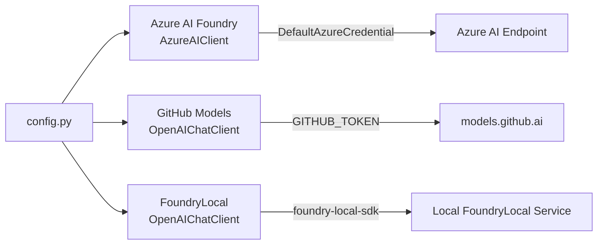

Per-agent model overrides via environment variables enable **hot-swapping models per agent** without code changes — run the Coordinator on a lightweight model for cost savings while keeping specialists on a more capable model for quality.

### 8. Frontend — `frontend/`

Next.js + CopilotKit v2 application. The API route (`app/api/copilotkit/route.ts`) bridges CopilotKit requests to the backend via AG-UI protocol using `HttpAgent`.

| Env Var | Default | Description |
|---------|---------|-------------|
| `CERTINATOR_AGENT_URL` / `AGENT_URL` | `http://127.0.0.1:8000/` | Backend agent HTTP endpoint |

### CopilotKit v2 Integration (Frontend ↔ Backend)

The frontend uses CopilotKit v2 hooks to bridge the MAF backend with a rich React UI. The AG-UI protocol is the transport layer between CopilotKit and the Agent Framework HTTP server.

| CopilotKit v2 Feature | Hook / Component | Purpose |
|--------------------|-----------------|---------|
| **Human-in-the-Loop** | `useHumanInTheLoop("request_info")` | Single dispatch hook — routes by `data.type` to `QuizSession`, `OfferCard` (study plan offer), or `OfferCard` (practice offer) |
| **Shared State (Read)** | `useAgent` | Reads `active_quiz_state` and `workflow_progress` from the backend's shared state |
| **Tool Renderer** | `useRenderTool("update_workflow_progress")` | Renders `WorkflowProgress` inline in the chat — one row per backend step |
| **Tool Renderer** | `useRenderTool("update_active_quiz_state")` | Renders `QuizDashboard` inline when quiz completes |
| **Agent Context** | `useAgentContext` | Exposes user preferences (difficulty, question count, locale) as context the backend agent can use |
| **Suggestions** | `useConfigureSuggestions` | Static suggestions: AZ-104 overview, AI-900 study plan, AI-102 practice quiz |

**Component mapping:**

| Component | CopilotKit Hook | Renders |
|-----------|----------------|---------|
| `CertinatorHooks` | All hooks above | Renderless (`return null`) — centralises all hook registrations in one file |
| `QuizSession` | `useHumanInTheLoop` | Full quiz UI: progress bar, dot navigation, A/B/C/D buttons, bulk submit |
| `QuizCard` | (Used by QuizSession) | Individual question card with clickable answer options |
| `OfferCard` | `useHumanInTheLoop` | Yes/No decision card for study plan and practice offers |
| `QuizDashboard` | `useAgent` + `useRenderTool` | Post-quiz summary: score, per-topic breakdown, question-by-question results |
| `WorkflowProgress` | `useRenderTool` | Step-by-step workflow progress with spinner/check icons and reasoning |
| `SlowRunIndicator` | `useAgent` (isRunning) | Warning indicator shown after 30s of active agent run, with cancel option |

---

## Frontend Architecture

### Component Architecture

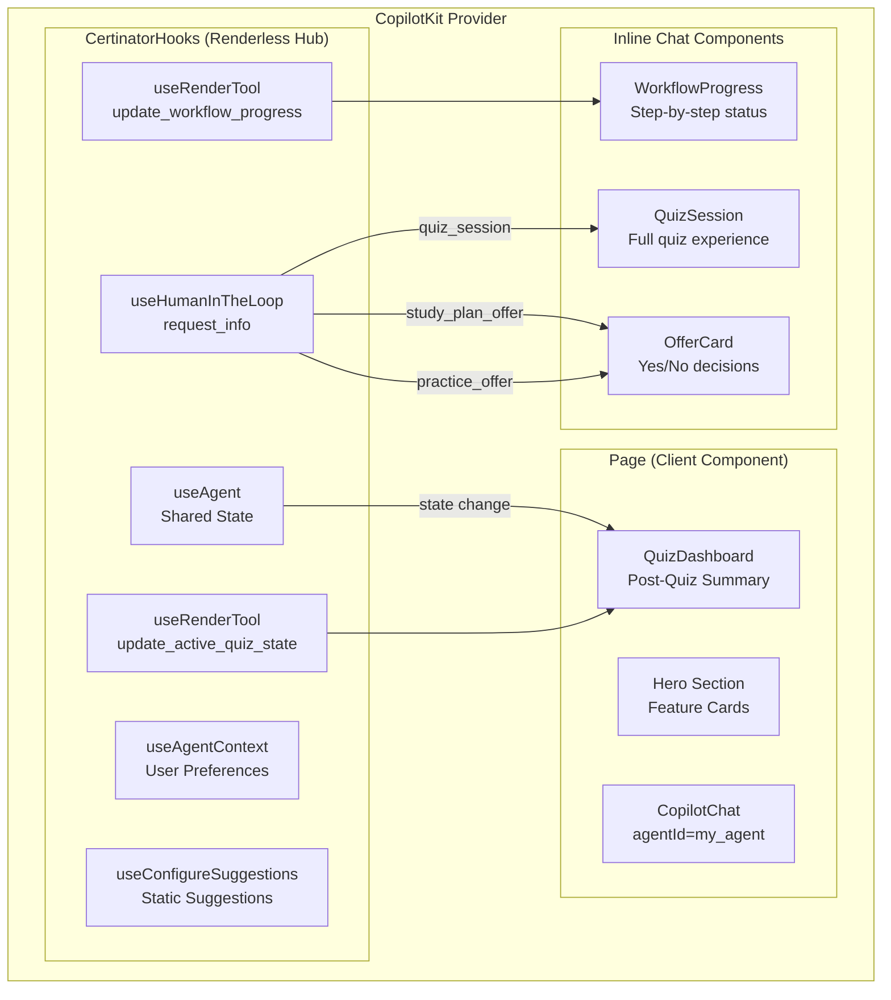

### AG-UI Protocol Bridge

The backend uses synthetic tool calls to push state updates to the frontend:

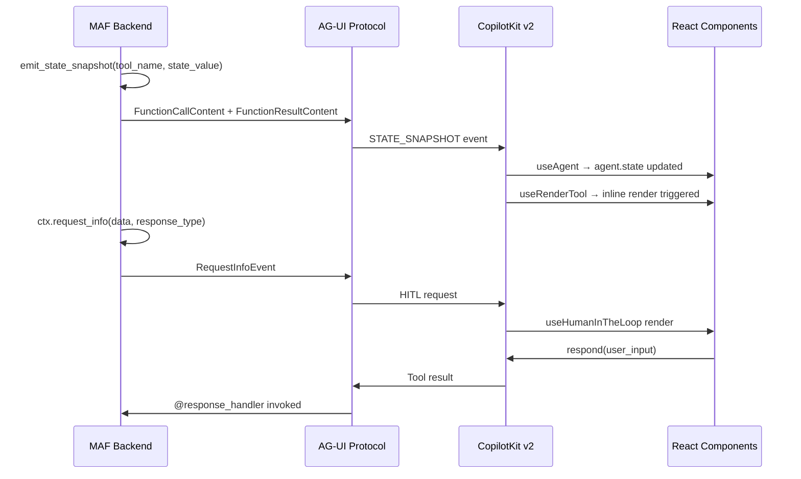

### predict_state_config Mapping

| State Key | Synthetic Tool Name | Tool Argument | Description |
|-----------|-------------------|---------------|-------------|
| `workflow_progress` | `update_workflow_progress` | `progress` | Current workflow step progress |
| `active_quiz_state` | `update_active_quiz_state` | `quiz_state` | Active quiz session state |
| `post_study_plan_context` | `update_post_study_plan_context` | `context` | Post-study-plan context for HITL |

### HITL Dispatch Pattern

MAF's `WorkflowAgent` emits all HITL interactions with tool name `request_info`. The frontend registers a single `useHumanInTheLoop("request_info")` hook that acts as a **multiplexer**, dispatching to the correct component based on `data.type`:

| `data.type` | Component | State Machine | Interaction |
|-------------|-----------|---------------|-------------|
| `quiz_session` | `QuizSession` | Streaming → Ready → Submitted | Full quiz with dot navigation, A/B/C/D buttons, bulk JSON submit |
| `study_plan_offer` | `OfferCard` | — | "Create study plan" / "Maybe later" after failed quiz |
| `practice_offer` | `OfferCard` | — | "Start practice" / "Not now" after study plan delivery |

### UX Patterns

| Pattern | Implementation |
|---------|---------------|
| **Progressive disclosure** | Hero panel auto-collapses after first workflow step detected |
| **Session persistence** | `useSessionStorage` with 30-min TTL, staleness guard, and graceful degradation |
| **Loading states** | `SlowRunIndicator` (30s), processing spinners, progressive submit labels |
| **Error handling** | `ErrorBoundary`, structured API error responses (502/504/500), `onError` logging |
| **Accessibility** | ARIA roles/labels, `role="status"`, `aria-live="polite"`, keyboard navigation, `.sr-only` |
| **Inactivity detection** | 5-minute idle timer during quizzes with warning |

---

## HITL (Human-in-the-Loop) Pattern

The system uses the MAF HITL pattern for interactive features:

1. An executor calls `ctx.request_info(request_data=<payload>, response_type=str)`
2. The workflow pauses and emits a `RequestInfoEvent` to the client
3. The frontend renders the appropriate component via `useHumanInTheLoop`
4. The user interacts and `respond(payload)` sends the response
5. The `@response_handler` decorated method receives the original request + response
6. The executor continues processing (present next question, route to another handler, or end)

**HITL points in the system:**

| Executor | HITL Action | User Input | Frontend Component |
|----------|-------------|------------|-------------------|
| `PracticeQuestionsExecutor` | Present all quiz questions at once | Bulk JSON answers `{"answers":{"1":"B",...}}` | `QuizSession` + `QuizCard` |
| `PracticeQuestionsExecutor` | Offer study plan after failed quiz (<70%) | yes/no | `OfferCard` |
| `PostStudyPlanExecutor` | Offer practice after study plan | yes/no | `OfferCard` |

---

## Critic Validation Loop

All specialist outputs (except practice quizzes, which use deterministic scoring) pass through `CriticExecutor`:

1. Specialist handler emits `SpecialistOutput` with `content_type` and `source_executor_id`
2. Critic agent validates content against quality checklists (different for `certification_info` vs. `study_plan`)
3. **PASS** → runs output safety gate (`validate_output()`), then:
   - `certification_info`: streams content directly to user
   - `study_plan`: emits `ApprovedStudyPlanOutput` → `PostStudyPlanExecutor` for HITL offer
4. **FAIL** → `RevisionRequest` sent back to source handler (conditional edges route by `source_executor_id`), carrying previous content + specific feedback
5. Max iterations: **2** — auto-approves with a visible disclaimer after the cap, preventing infinite token consumption

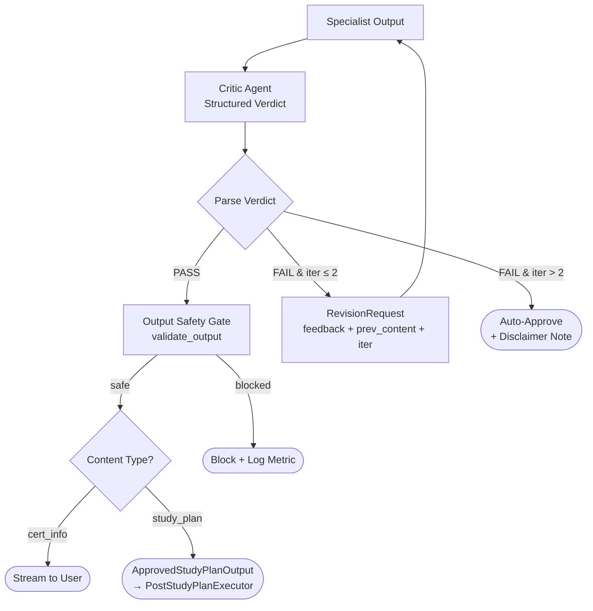

---

## Reasoning Patterns

The system implements several well-established reasoning patterns to improve robustness, transparency, and quality of outputs.

### 1. Planner–Executor Pattern

The **Coordinator** acts as the planner — classifying user intent via structured output (`CoordinatorResponse`) with an explicit `reasoning` field for chain-of-thought. It emits a `RoutingDecision` that the `WorkflowBuilder` graph topology routes deterministically to specialist executors.

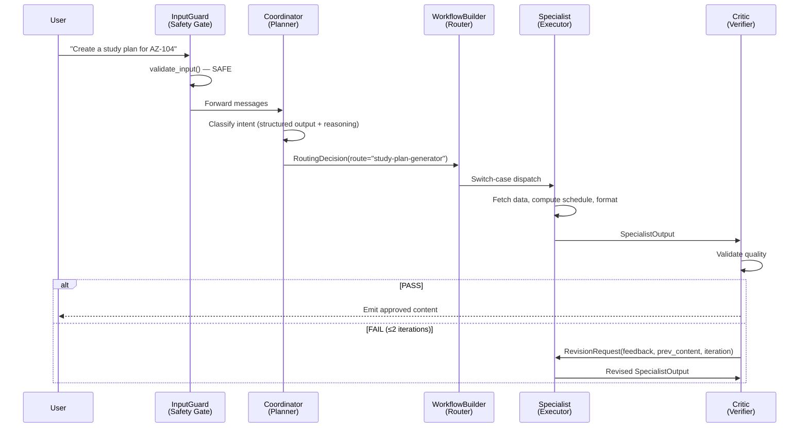

### 2. Critic / Verifier Pattern

A shared `CriticExecutor` validates all specialist outputs before they reach the user:

- **Structured verdict**: The Critic agent outputs `CriticVerdictResponse` with `PASS`/`FAIL`, confidence score (0-1), identified issues, and improvement suggestions.
- **Content-specific checklists**: Different validation criteria for `certification_info` (structure, completeness, accuracy) vs. `study_plan` (schedule coherence, coverage, formatting).
- **Bounded iteration**: Maximum **2 revision attempts**, then auto-approves with a visible disclaimer. This prevents infinite token-burning loops.
- **Output safety gate**: After critic approval, content passes through `validate_output()` before emission — a final content safety check.

### 3. Self-Reflection & Iteration

The critic revision loop implements self-reflection. When content fails validation, the `RevisionRequest` carries:

- `previous_content` — what was rejected
- `feedback[]` — specific issues identified by the Critic
- `iteration` counter — so the specialist knows how many attempts remain and can adjust strategy

The specialist uses this context to revise its output, creating a structured feedback loop.

### 4. Role-Based Specialization

Each of the 6 agents has a distinct instruction set, model configuration, and tool set — no overlap in responsibilities:

| Agent | Role | Why Separate |
|-------|------|-------------|
| **Coordinator** | Intent classification | Routing is classification; separate from generation |
| **CertInfo** | Info retrieval | Needs MCP tool and specific retrieval strategy instructions |
| **LearningPathFetcher** | Structured extraction | Schema-constrained JSON output contract differs from CertInfo |
| **StudyPlan** | Formatting | Math offloaded to `compute_schedule()`; LLM does prose only |
| **Practice** | Dual-mode generation | Question gen and feedback reports have distinct prompts and output schemas |
| **Critic** | Validation | Review requires different criteria than generation |

### 5. Deterministic Computation

Critical calculations are **never delegated to LLMs** — they use deterministic Python functions:

| Computation | Function | Description |
|-------------|----------|-------------|
| Quiz scoring | `score_quiz()` | Overall %, per-topic breakdown, weak topic identification (<70%) |
| Study scheduling | `compute_schedule()` | Week-by-week schedule from topics, hours/week, duration, with time budgeting |
| Topic extraction | `extract_topic_distribution()` | Exam topic names and weights from learning path data, normalized to 100% |
| Question validation | `validate_questions()` | Structural integrity checks with retry logic (up to 2x) before delivery |

---

## Custom OTel Metrics

All custom metrics are defined in `src/metrics.py` as module-level singletons, created via the OpenTelemetry `metrics.get_meter("certinator_ai", "1.0.0")` API. Instruments are created once and reused across executors.

### Metrics Catalog

| Metric | Type | Attributes | Emitted by |
|--------|------|-----------|------------|
| `certinator.coordinator.routing_decisions` | Counter | `route` | `CoordinatorExecutor` — every routing decision |
| `certinator.critic.verdicts` | Counter | `verdict`, `content_type`, `auto_approved` | `CriticExecutor` — every PASS/FAIL verdict |
| `certinator.quiz.score_pct` | Histogram | `certification` | `PracticeQuestionsExecutor` — overall quiz score (0–100) |
| `certinator.quiz.topic_score_pct` | Histogram | `topic`, `certification` | `PracticeQuestionsExecutor` — per-topic score (0–100) |
| `certinator.hitl.study_plan_offers` | Counter | `accepted` | `PracticeQuestionsExecutor` — post-quiz study plan offer responses |
| `certinator.hitl.practice_offers` | Counter | `accepted` | `PostStudyPlanExecutor` — post-study-plan practice offer responses |
| `certinator.mcp.calls` | Counter | `executor`, `status` | `CertInfoExecutor`, `LearningPathFetcherExecutor` — MCP call outcomes |
| `certinator.mcp.unavailable_events` | Counter | `executor`, `degraded` | `CertInfoExecutor` — MCP unavailability triggers |
| `certinator.safety.blocks` | Counter | `reason`, `category` | `InputGuardExecutor` — input safety violations |
| `certinator.safety.output_blocks` | Counter | `content_type`, `source_executor` | `CriticExecutor` — output safety violations |
| `certinator.rate_limit.rejections` | Counter | `limit_type`, `client_ip` | `RateLimiterMiddleware` — rate limit violations |

### Metrics Flow

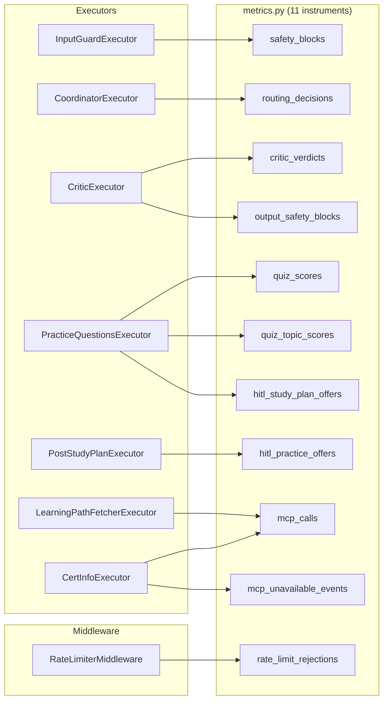

---

## Evaluations & Telemetry

### Current Observability

| Layer | Technology | Description |
|-------|-----------|-------------|
| **Distributed tracing** | OpenTelemetry (gRPC port 4317) | Sends traces to Aspire Dashboard or AI Toolkit trace viewer in VS Code |
| **Custom metrics** | 11 OTel instruments | Business-semantic metrics (routing, quality, safety, HITL engagement) |
| **Health endpoints** | `/health` (liveness), `/ready` (readiness) | Checks LLM endpoint, MCP server, and thread store |
| **Workflow visualization** | `WorkflowViz` | Generates Mermaid diagrams, DiGraph, and SVG exports on build |
| **Workflow progress** | Synthetic state snapshots | Real-time step-by-step progress sent to frontend via `update_workflow_progress` |

### Evaluation Suite

**8 deterministic custom evaluators + 3 optional LLM-based SDK evaluators** covering all critical quality dimensions. Custom evaluators require **no LLM calls** — they run fast in CI/CD.

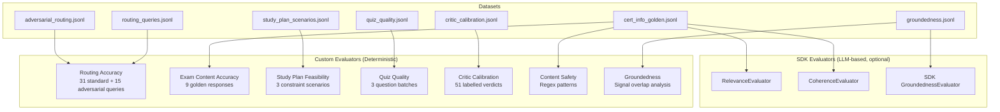

#### Evaluation Details

| # | Evaluator | Method | Dataset (Rows) | Key Metric | Pass Criteria |
|---|-----------|--------|----------------|------------|---------------|
| 1 | **Routing Accuracy** | Deterministic (exact match) | routing_queries.jsonl (31) | `routing_accuracy_score` | Score = 5 (exact match) |
| 2 | **Routing Accuracy (Adversarial)** | Deterministic (exact match) | adversarial_routing.jsonl (15) | `routing_accuracy_score` | Score = 5 |
| 3 | **Exam Content Accuracy** | Deterministic (keyword scan) | cert_info_golden.jsonl (9) | `exam_content_accuracy_score` (1-5) | Score ≥ 4 (≥5/6 sections) |
| 4 | **Study Plan Feasibility** | Deterministic (JSON assertions) | study_plan_scenarios.jsonl (3) | `study_plan_feasibility_score` (1-5) | Score ≥ 4 (≤1 violation) |
| 5 | **Quiz Quality** | Deterministic (structural validation) | quiz_quality.jsonl (3) | `quiz_quality_score` (1-5) | Score ≥ 4 (≤1 violation) |
| 6 | **Critic Calibration** | Deterministic (verdict match) | critic_calibration.jsonl (51) | precision, recall, F1, confidence MAE | Per evaluation thresholds |
| 7 | **Content Safety** | Deterministic (regex) | cert_info_golden.jsonl (9) | `content_safety_score` (5/3/1) | Score = 5 (clean) |
| 8 | **Groundedness** | Deterministic (signal overlap) | groundedness.jsonl (9) | `groundedness_ratio` (0.0-1.0) | Ratio ≥ 60% |
| 9 | **Relevance** (SDK) | LLM-based | cert_info_golden.jsonl (9) | SDK relevance score | SDK thresholds |
| 10 | **Coherence** (SDK) | LLM-based | cert_info_golden.jsonl (9) | SDK coherence score | SDK thresholds |
| 11 | **Groundedness** (SDK) | LLM-based | groundedness.jsonl (9) | SDK groundedness score | SDK thresholds |

#### Critic Calibration — Evaluating the Evaluator

The critic calibration evaluator is noteworthy because it **evaluates the system's own quality gate**. Using 51 human-labelled samples (GOOD/BAD), it produces:

- **Confusion matrix**: TP (correct PASS), TN (correct FAIL), FP (false PASS), FN (false FAIL)
- **Precision**: Of verdicts labelled PASS, how many were actually good?
- **Recall**: Of actually good content, how many were correctly passed?
- **F1 score**: Harmonic mean of precision and recall
- **Confidence MAE**: Calibration error — does the critic's confidence score match its accuracy?

This meta-evaluation ensures the critic isn't blindly approving everything or being overly strict.

#### CLI

```bash
python -m evaluations --run              # Full pipeline (custom + SDK)
python -m evaluations --run --no-builtin # Custom evaluators only (no Azure OpenAI needed)
python -m evaluations --generate-dataset # List available datasets with row counts
```

---

## Responsible AI

### Six-Layer Defense-in-Depth

The safety architecture implements six observable layers of protection:

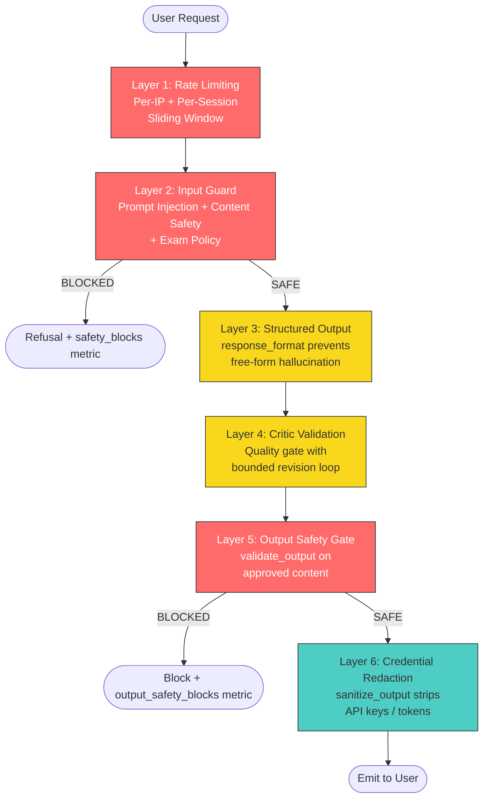

### Implemented Guardrails

| Layer | Guardrail | Implementation | Observable |
|-------|-----------|---------------|------------|
| 1 | **Rate limiting** | `RateLimiterMiddleware` — per-IP (60/min) + per-session (20/min) sliding window | `rate_limit_rejections` counter |
| 2 | **Prompt injection detection** | 15+ regex pattern categories in `safety.py` (override, persona hijack, jailbreak, exfiltration, encoded) | `safety_blocks` counter |
| 2 | **Content safety filtering** | 5 categories: hate speech, violence, self-harm, sexual, illegal | `safety_blocks` counter |
| 2 | **Exam integrity policy** | 2 categories: exam dump requests, score manipulation | `safety_blocks` counter |
| 3 | **Structured output** | `response_format` on Coordinator (`CoordinatorResponse`) and Critic (`CriticVerdictResponse`) | — |
| 4 | **Critic validation** | Quality gate with content-specific checklists | `critic_verdicts` counter |
| 4 | **Bounded revision loops** | Maximum 2 critic iterations, then auto-approve with visible disclaimer | `auto_approved` attribute |
| 5 | **Output content safety** | `validate_output()` on all critic-approved content before emission | `output_safety_blocks` counter |
| 6 | **Credential redaction** | `sanitize_output()` strips API keys, Bearer tokens, password/secret patterns | — |
| — | **Safety system prompt** | `SAFETY_SYSTEM_PROMPT` injected into every agent's instructions | — |
| — | **Deterministic scoring** | LLMs never perform arithmetic — `score_quiz()` and `compute_schedule()` are pure Python | — |
| — | **Question validation** | `validate_questions()` checks structural integrity with retry (2x) before delivery | — |
| — | **Transient error retry** | `safe_agent_run()` with exponential backoff (5 attempts, 1-30s) | — |
| — | **MCP error handling** | Graceful degradation with user-friendly error message + `mcp_unavailable_events` metric | `mcp_unavailable_events` counter |

Every safety block, rejection, and output modification is counted via OTel metrics, enabling continuous monitoring of safety effectiveness.

---

## Deployment Architecture

### Current Development Setup

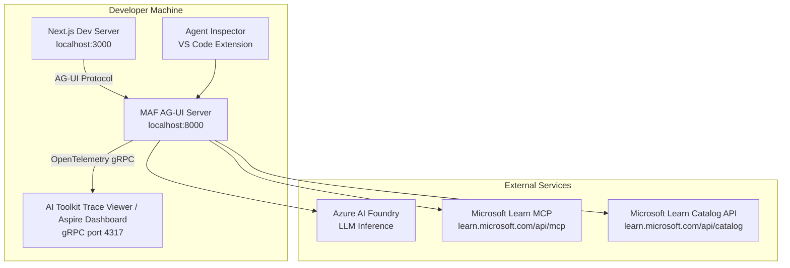

### Thread Persistence

Conversation threads are stored in an in-memory dictionary (`_thread_store`). Threads persist across requests within the same server process but are lost on restart. The persistence layer is isolated in `thread_store.py` for future replacement with a durable store (e.g., Azure Cosmos DB, Redis).

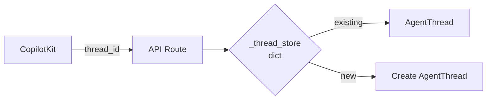

### Custom Orchestrator Chain

The AG-UI integration uses a custom orchestrator chain to handle MAF's HITL pattern and state synchronization:

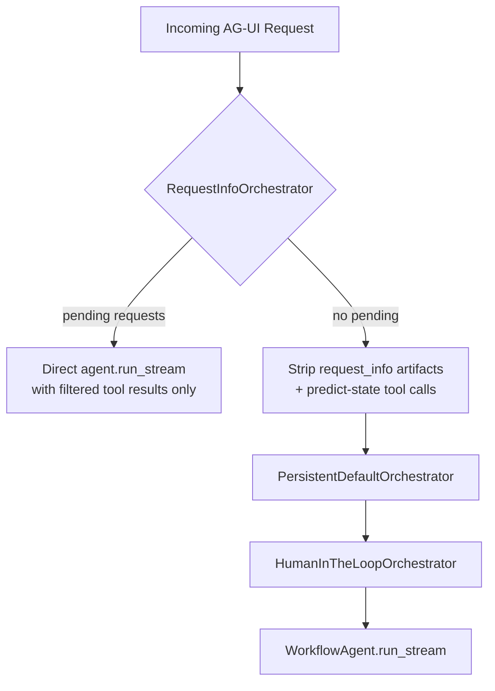

- **RequestInfoOrchestrator**: Handles orphaned `request_info` artifacts from MAF's HITL pattern. Strips stale predict-state tool call names from history to prevent key errors.
- **PersistentDefaultOrchestrator**: Extends `DefaultOrchestrator`, suppresses trailing `MessagesSnapshotEvent` to preserve correct streaming message order for CopilotKit rendering.

### Scalability Considerations

| Component | Current | Production Change |
|-----------|---------|-------------------|
| Thread store | In-memory dict | Azure Cosmos DB or Redis |
| Rate limiting | In-memory sliding window | Redis-backed distributed rate limiting |
| Deployment | Local dev server | Azure Container Apps with managed identity |
| Observability | Aspire Dashboard / AI Toolkit trace viewer | Azure Monitor / Application Insights |
| Secrets | Env vars / `.env` | Azure Key Vault |
| Frontend | Next.js dev server | Vercel or Azure Static Web Apps |

**What already scales well**: Stateless executors (no shared mutable state), per-agent model overrides, `DefaultAzureCredential` (supports managed identity), health endpoints (K8s/ACA-ready), `safe_agent_run()` retry logic.

---

## File Structure

```
src/
├── app.py                          # Entrypoint (FastAPI + AG-UI + Uvicorn)
├── config.py                       # Environment configuration (multi-provider)
├── health.py                       # /health and /ready endpoints
├── metrics.py                      # Custom OpenTelemetry metrics (11 instruments)
├── orchestrators.py                # Custom AG-UI orchestrators (RequestInfo, Persistent)
├── rate_limiter.py                 # Per-IP + per-session sliding-window rate limiter
├── safety.py                       # Input/output safety: injection, content, exam policy, redaction
├── state_schema.py                 # predict_state_config + state_schema for CopilotKit
├── thread_store.py                 # In-memory thread persistence
├── workflow.py                     # Workflow graph builder (WorkflowBuilder)
├── agents/
│   ├── __init__.py                 # Re-exports all agent factories
│   ├── coordinator_agent.py        # Intent classification (structured CoordinatorResponse)
│   ├── certification_info_agent.py # Certification info (MCP search strategy)
│   ├── learning_path_fetcher_agent.py  # Topic extraction (MCP + Catalog API, JSON contract)
│   ├── study_plan_generator_agent.py   # Study plan Markdown formatting (receives computed schedule)
│   ├── practice_questions_agent.py # Dual-mode: JSON question gen + Markdown feedback
│   └── critic_agent.py            # Quality validation (CriticVerdictResponse)
├── executors/
│   ├── __init__.py                 # Shared helpers (emit_response, safe_agent_run, etc.)
│   ├── events.py                   # Event emission: emit_response_streamed, emit_state_snapshot, update_workflow_progress
│   ├── retry.py                    # safe_agent_run / safe_agent_run_stream (tenacity, 5 attempts)
│   ├── quiz_feedback.py            # generate_feedback_report + fallback_feedback
│   ├── input_guard_executor.py     # InputGuardExecutor (start node — safety gate)
│   ├── coordinator_executor.py     # CoordinatorExecutor (intent → RoutingDecision)
│   ├── certification_info_executor.py  # CertInfoExecutor (MCP retrieval + revision)
│   ├── learning_path_fetcher_executor.py # LearningPathFetcherExecutor (MCP + Catalog + JSON parsing)
│   ├── study_plan_generator_executor.py  # StudyPlanGeneratorExecutor (compute_schedule + LLM format)
│   ├── critic_executor.py          # CriticExecutor (validation + output safety gate)
│   ├── post_study_plan_executor.py # PostStudyPlanExecutor (stream plan + HITL practice offer)
│   └── practice_questions_executor.py  # PracticeQuestionsExecutor (full quiz lifecycle)
│   └── models/                     # All typed data models (Pydantic)
│       ├── __init__.py
│       ├── routing.py              # RoutingDecision, CoordinatorResponse
│       ├── critic.py               # CriticVerdict, CriticVerdictResponse, SpecialistOutput
│       ├── learning_paths.py       # SkillAtAGlance, TrainingModule, LearningPath, LearningPathsData
│       ├── scheduling.py           # StudyConstraints, ScheduleWeek, ScheduleResult
│       ├── practice.py             # PracticeQuestion, QuizState
│       └── cross_workflow.py       # RevisionRequest, ApprovedStudyPlanOutput, StudyPlanFromQuizRequest
├── tools/
│   ├── __init__.py
│   ├── mcp.py                      # MS Learn MCP tool factory + is_mcp_error()
│   ├── mslearn_catalog.py          # fetch_exam_learning_paths (@ai_function) + Catalog API + 24h disk cache
│   ├── mslearn_cache.py            # Disk cache management for learning paths
│   ├── schedule.py                 # schedule_study_plan (@ai_function) + compute_schedule()
│   ├── practice.py                 # score_quiz, validate_questions, parse_questions, parse_answer_payload
│   └── topics.py                   # extract_topic_distribution()
├── utils/
│   └── delete_foundry_agents.py    # Utility for cleaning up Azure AI Foundry agents
frontend/
├── app/
│   ├── page.tsx                    # Main UI — hero (auto-collapse), quiz dashboard, CopilotChat
│   ├── layout.tsx                  # Root layout — CopilotKit provider, dark theme
│   ├── types.ts                    # Shared TS types (mirrors backend models)
│   ├── globals.css                 # Global styles (quiz cards, offer cards, workflow progress)
│   ├── components/
│   │   ├── CertinatorHooks.tsx     # Renderless hub — all CopilotKit v2 hook registrations
│   │   ├── CopilotKitProvider.tsx  # CopilotKit provider + CSS-variable theming
│   │   ├── QuizSession.tsx         # Full quiz UI (dot nav, progress, A/B/C/D, bulk submit, sessionStorage)
│   │   ├── QuizCard.tsx            # Individual quiz question card (ARIA, lockable options)
│   │   ├── OfferCard.tsx           # HITL yes/no offer card (reusable, confirmation state)
│   │   ├── QuizDashboard.tsx       # Post-quiz summary (score, per-topic, question results)
│   │   ├── WorkflowProgress.tsx    # Step-by-step workflow status (ratchet ref, route-scoped)
│   │   ├── WorkflowProgressContext.tsx # React context for workflow progress snapshots
│   │   ├── SlowRunIndicator.tsx    # 30s warning + cancel option (abortRun)
│   │   └── ErrorBoundary.tsx       # React error boundary with auto-recovery
│   ├── hooks/
│   │   └── useSessionStorage.ts    # Session persistence with 30-min TTL + staleness guard
│   └── api/copilotkit/route.ts     # CopilotKit → Agent Framework bridge (HttpAgent, error handling)
├── patches/
│   └── @copilotkitnext__react@1.52.0-next.8.patch  # SDK patch
└── public/                         # Static assets
evaluations/
├── evaluation.py                   # Evaluation runner (custom + SDK evaluators)
├── __main__.py                     # CLI: --run [--no-builtin] | --generate-dataset
├── datasets/
│   ├── routing_queries.jsonl       # 31 standard routing queries
│   ├── adversarial_routing.jsonl   # 15 adversarial/edge-case queries
│   ├── cert_info_golden.jsonl      # 9 golden certification overviews
│   ├── study_plan_scenarios.jsonl  # 3 schedule constraint scenarios
│   ├── quiz_quality.jsonl          # 3 question batches (valid + broken)
│   ├── critic_calibration.jsonl    # 51 human-labelled critic verdicts
│   └── groundedness.jsonl          # 9 source-document grounding samples
├── evaluators/
│   ├── routing_accuracy.py         # Exact-match route classification
│   ├── exam_content_accuracy.py    # Section keyword scanning (6 sections)
│   ├── study_plan_feasibility.py   # JSON assertion (hours, weeks, coverage)
│   ├── quiz_quality.py             # Structural validation (options, duplicates, topics)
│   ├── critic_calibration.py       # Confusion matrix, precision/recall/F1, confidence MAE
│   ├── content_safety.py           # Regex safety patterns
│   └── groundedness.py             # Signal overlap (URLs, facts, phrases, entities)
└── results/                        # Timestamped JSON evaluation results
```

---

## Design Principles

1. **Typed message passing**: All inter-executor data flows through Pydantic models — no raw strings or dicts at boundaries. Every message type is defined in `src/executors/models/`.

2. **Deterministic where possible**: Scoring (`score_quiz`), scheduling (`compute_schedule`), topic extraction (`extract_topic_distribution`), and question validation (`validate_questions`) are Python functions — LLMs never do arithmetic or structural validation.

3. **LLMs for language**: Agents handle classification, generation, and formatting — tasks where language understanding adds measurable value.

4. **Single-responsibility executors**: Each executor owns one concern. New features add new executors rather than growing existing ones. The `general_handler` demonstrates that even the simplest node (echo response) gets its own executor.

5. **Critic gate**: Specialist outputs pass through quality validation before reaching the user, with bounded revision loops and output safety checks.

6. **HITL for decisions**: Workflow pauses for meaningful student choices (quiz answers, study plan acceptance, practice offers) using the MAF `request_info`/`response_handler` pattern.

7. **Observable safety**: Every safety block, rejection, and output modification is counted via OTel metrics. Safety isn't a checkbox — it's continuously monitored.

8. **Reusable agents**: The same agent instance (e.g., `learning_path_agent`) can be shared across multiple executors that need the same capability.

9. **Graceful degradation**: MCP failures, LLM timeouts, and JSON parse errors are handled with retries, fallbacks, and user-friendly messages — the system never crashes on a transient error.

10. **Evaluate the evaluator**: The critic calibration evaluator measures the critic's own precision/recall/F1 — ensuring the quality gate itself is trustworthy.