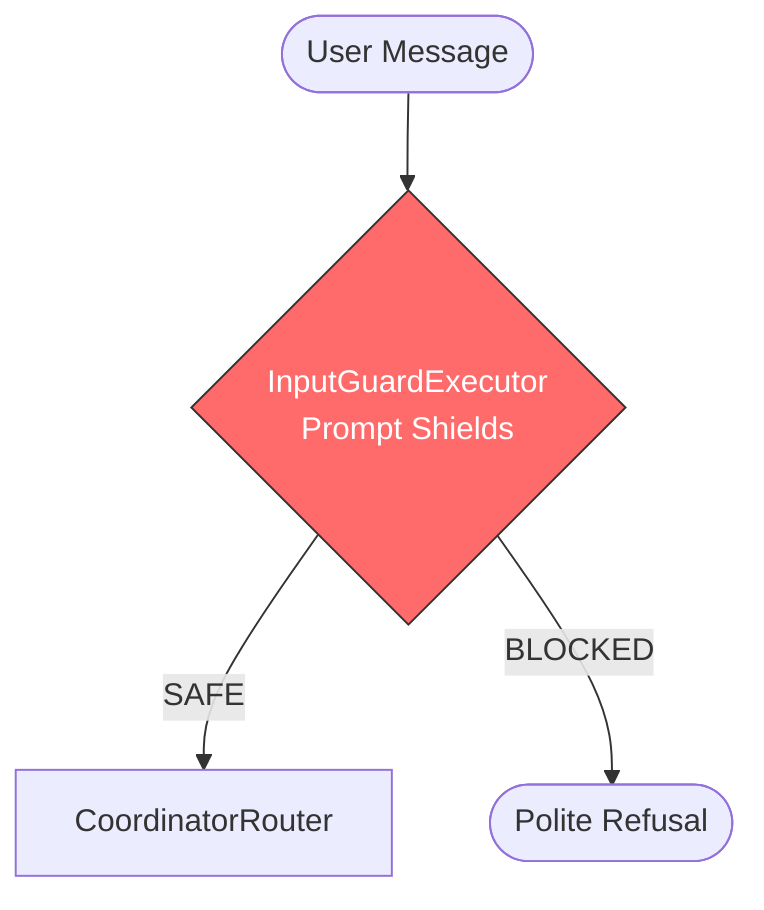
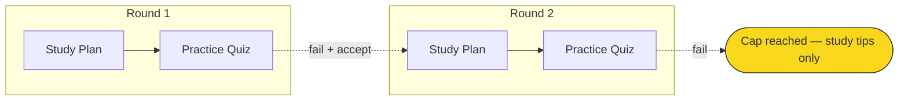

# Certinator AI — Architecture Gaps

Gap analysis comparing the current implementation against the [project requirements](PROJECT.md) and the [Agents League Reasoning Agents track](https://github.com/microsoft/agentsleague/tree/main/starter-kits/2-reasoning-agents) criteria.

> This document was generated by analyzing every source file in the codebase against the requirements below. Each gap includes priority, effort estimate, and recommended approach.

---

## Table of Contents

- [Requirements Compliance Matrix](#requirements-compliance-matrix)
- [Evaluation Criteria Coverage](#evaluation-criteria-coverage)
- [Gap Details](#gap-details)
  - [G1 — Input Guard (Prompt Shields)](#g1--input-guard-prompt-shields)
  - [G2 — Output Content Safety](#g2--output-content-safety)
  - [G3 — MCP Fallback for LearningPathFetcher](#g3--mcp-fallback-for-learningpathfetcher)
  - [G4 — Cross-Route Cycle Breaker](#g4--cross-route-cycle-breaker)
  - [G5 — End-to-End Evaluations](#g5--end-to-end-evaluations)
  - [G6 — Critic Calibration Evaluation](#g6--critic-calibration-evaluation)
  - [G7 — Coordinator CoT Reasoning Field](#g7--coordinator-cot-reasoning-field)
  - [G8 — Persistent Thread Store](#g8--persistent-thread-store)
  - [G9 — Health Check Endpoints](#g9--health-check-endpoints)
  - [G10 — Groundedness Evaluation](#g10--groundedness-evaluation)
  - [G11 — PII Detection in Telemetry](#g11--pii-detection-in-telemetry)
  - [G12 — Rate Limiting](#g12--rate-limiting)
  - [G13 — Dynamic Suggestions](#g13--dynamic-suggestions)
  - [G14 — Accessibility (WCAG)](#g14--accessibility-wcag)
  - [G15 — Frontend Error Resilience](#g15--frontend-error-resilience)
  - [G16 — Frontend Testing](#g16--frontend-testing)
  - [G17 — Agent Streaming](#g17--agent-streaming)
  - [G18 — MCP Result Caching](#g18--mcp-result-caching)
  - [G19 — Token Budget Controls](#g19--token-budget-controls)
  - [G20 — Citation Tracking](#g20--citation-tracking)
- [Gap Summary by Priority](#gap-summary-by-priority)
- [Requirement-to-Gap Mapping](#requirement-to-gap-mapping)

---

## Requirements Compliance Matrix

| Requirement | Status | Evidence | Gaps |
|-------------|--------|----------|------|
| **Multi-agent system** aligned with PROJECT.md | ✅ Implemented | 6 agents, 8 executors, WorkflowBuilder graph | — |
| **Reasoning** and multi-step decision-making | ✅ Implemented | Planner-Executor, Critic/Verifier, Self-reflection, Role-based specialization, Deterministic computation, **Coordinator CoT reasoning field (G7)** | — |
| **External tools, APIs, MCP** integration | ✅ Implemented | MS Learn MCP, `schedule_study_plan` @ai_function, `score_quiz` Python tool | G18 (MCP caching) |
| **Demoable** with clear agent interactions | ✅ Implemented | CopilotKit chat UI, workflow progress rendering, quiz cards, offer cards | G14 (accessibility) |
| **Clear documentation** — agent roles, reasoning flow, tool integrations | ✅ Implemented | ARCHITECTURE.md with Mermaid diagrams, workflow.svg, inline docstrings | — |
| **Evaluations, telemetry, monitoring** | ⚠️ Partial | OTel tracing, custom metrics (8 instruments), **end-to-end evaluation pipeline (6 custom evaluators, JSONL datasets, CLI orchestrator)**, **Critic calibration evaluation (precision/recall/F1)** | G10 |
| **Advanced reasoning patterns** (planner-executor, critics, reflection loops) | ✅ Implemented | All four patterns implemented, **Coordinator CoT reasoning (G7)** | — |
| **Responsible AI** (guardrails, validation, fallbacks) | ✅ Implemented | Critic gate, structured output, deterministic scoring, MCP fallback (CertInfo + LearningPathFetcher), bounded loops, **InputGuardExecutor (regex-based)**, **Output content safety in CriticExecutor** | G11, G12 |

---

## Evaluation Criteria Coverage

| Criterion | Score | Strengths | Gaps |
|-----------|-------|-----------|------|
| **Accuracy & Relevance** | Strong | MCP-grounded retrieval, structured output, critic validation, deterministic scoring, **Critic calibration evaluation (G6)** | G10 (Groundedness evaluation) |
| **Reasoning & Multi-step Thinking** | Strong | 5 reasoning patterns, typed message graph, conditional routing, revision loops, **Coordinator CoT audit trail (G7)** | — |
| **Creativity & Originality** | Strong | Cross-route bidirectional flows (Practice ↔ StudyPlan), deterministic math offloading, dual-mode Practice agent, MCP fallback with disclaimer | — |
| **User Experience & Presentation** | Good | CopilotKit v2 HITL, inline workflow progress, quiz session UI, offer cards | G13 (dynamic suggestions), G14 (accessibility), G17 (streaming) |
| **Reliability & Safety** | Good | Bounded loops, transient error retry, question validation, structured output, **InputGuardExecutor (prompt injection + content safety + exam policy)**, **Output content safety gate**, **Cross-route cycle breaker (G4)** | G12, G15 |

---

## Gap Details

### G1 — Input Guard (Prompt Shields)

| Attribute | Value |
|-----------|-------|
| **Priority** | P0 — Critical |
| **Effort** | Medium (2-3 days) |
| **Requirement** | Responsible AI — guardrails |
| **Criterion** | Reliability & Safety |

**Current state:** The Coordinator receives raw user input and routes it with no safety screening. A prompt injection attack could manipulate the `route` field or cause the Coordinator to emit arbitrary routing decisions.

**Gap:** No input validation against jailbreak or prompt injection attacks before the LLM processes user messages.

**Recommended approach:**
- Add an `InputGuardExecutor` as the **first** node in the workflow graph (before the Coordinator)
- Use Azure AI Content Safety's Prompt Shields API (`/text:shieldPrompt`) to detect jailbreak and indirect injection
- On detection: emit a polite refusal message and terminate the workflow — never forward to the Coordinator
- This is a single HTTP call (~100ms latency), not an LLM call, so overhead is minimal

---

### G2 — Output Content Safety

| Attribute | Value |
|-----------|-------|
| **Priority** | P1 — High |
| **Effort** | Medium (2-3 days) |
| **Requirement** | Responsible AI — guardrails |
| **Criterion** | Reliability & Safety |

**Status: ✅ IMPLEMENTED** — Output content safety is enforced inside `CriticExecutor` via the `validate_output()` function from `safety.py`. After the Critic agent's quality review (PASS or auto-approve), but before content is emitted to the user or forwarded to `PostStudyPlanExecutor`, the approved text is run through:

1. **Content safety checks** — regex-based detection of hate speech, violence, self-harm, sexual content, and illegal activity patterns.
2. **Exam integrity policy** — blocks exam dump requests and score manipulation attempts in outputs.
3. **Credential sanitisation** — redacts accidentally leaked API keys, tokens, and passwords.

If the output is flagged as unsafe, the text is replaced with a polite refusal. A `certinator.safety.output_blocks` OTel counter tracks blocked outputs by `content_type` and `source_executor`.

This uses the same local regex-based approach as G1 (no Azure AI Content Safety API dependency).

---

### G3 — MCP Fallback for LearningPathFetcher

| Attribute | Value |
|-----------|-------|
| **Priority** | P1 — High |
| **Effort** | Low (1 day) |
| **Requirement** | External tool integration, Responsible AI — fallbacks |
| **Criterion** | Reliability & Safety |
| **Status** | ✅ **Implemented** |

**Implementation:** `LearningPathFetcherExecutor` now mirrors the `CertificationInfoExecutor` graceful-degradation pattern. When MS Learn MCP is unavailable, it falls back to a no-MCP agent that answers from training knowledge with a prominent disclaimer.

**What was built:**
- **`FALLBACK_INSTRUCTIONS`** in `agents/learning_path_fetcher_agent.py` — instructs the fallback agent to produce topic structures from training knowledge with an unavailability disclaimer, while never fabricating URLs
- **`create_learning_path_fetcher_agent_no_mcp()`** factory — creates a `LearningPathFetcherAgent-Fallback` instance with no MCP tools, identical pattern to `create_cert_info_agent_no_mcp()`
- **`learning_path_fallback_agent`** parameter added to `LearningPathFetcherExecutor.__init__()` — optional fallback agent, defaults to `None` for backward compatibility
- **`_fetch_with_fallback()`** helper method — sends the original prompt to the fallback agent with the same `LearningPathFetcherResponse` structured output format
- **Fallback wired in both handlers** — `handle()` (regular routing) and `handle_quiz_study_plan()` (post-quiz flow) both try the fallback agent on MCP errors before emitting an error message
- **OTel metrics** — `mcp_unavailable_events` now reports `degraded: "true"` when the fallback agent is used, matching the CertInfo pattern
- **Workflow wiring** — `build_workflow()` in `workflow.py` creates the fallback agent and passes it to the executor

**Degradation behaviour:**
- MCP error + fallback agent configured → fallback agent produces topic structure from training knowledge → study plan pipeline continues normally
- MCP error + no fallback agent → existing generic error message (backward compatible)
- Fallback agent also fails → generic error message emitted

---

### G4 — Cross-Route Cycle Breaker

| Attribute | Value |
|-----------|-------|
| **Priority** | P1 — High |
| **Effort** | Low (0.5 days) |
| **Requirement** | Reliability & Safety |
| **Criterion** | Reliability & Safety |
| **Status** | ✅ **Implemented** |

**Implementation:** A shared-state cycle counter (`cross_route_cycle_count`) limits the number of full Practice ↔ StudyPlan round-trips to 2. When the cap is reached, both executors suppress their cross-route offers and emit study tips instead.

**What was built:**
- **`CROSS_ROUTE_CYCLE_KEY`** and **`MAX_CROSS_ROUTE_CYCLES = 2`** constants in `post_study_plan_executor.py` — shared between both executors via import
- **`PostStudyPlanExecutor.handle()`** — reads the counter from `ctx.shared_state` before offering practice; if `>= 2`, emits a closing message with study tips instead of the HITL practice offer
- **`PostStudyPlanExecutor.on_practice_offer()`** — increments the counter when the student accepts the practice offer (before routing to `PracticeQuestionsExecutor`)
- **`PracticeQuestionsExecutor._score_and_report()`** — on quiz failure, reads the counter; if `>= 2`, emits study tips instead of the HITL study plan offer, preventing the entire StudyPlan pipeline from starting
- **`certinator.cycle_breaker.cap_reached`** OTel counter metric — recorded when either executor hits the cap, with `source_executor` and `certification` attributes
- **12 unit tests** in `tests/test_cycle_breaker.py` — covering counter at 0, 1, 2, above cap, increment on acceptance, no increment on decline, constant consistency

**Cycle behaviour:**

| Round | Counter | PostStudyPlan | PracticeQuestions (fail) |
|-------|---------|---------------|-------------------------|
| 1 | 0 → 1 | Offers practice | Offers study plan |
| 2 | 1 → 2 | Offers practice | Offers study plan |
| 3 | 2 (cap) | Study tips only | Study tips only |

---

### G5 — End-to-End Evaluations ✅ IMPLEMENTED

| Attribute | Value |
|-----------|-------|
| **Priority** | P1 — High |
| **Effort** | High (5-7 days) |
| **Requirement** | Evaluations, telemetry, monitoring |
| **Criterion** | Accuracy & Relevance |
| **Status** | ✅ **Implemented** |

**Implementation:** Full evaluation pipeline in `evaluations/` package with 5 custom evaluators, JSONL datasets, CLI orchestrator, and Azure AI Evaluation SDK integration.

**What was built:**
- **5 custom evaluators** following the `__call__(*, response, **kwargs) → dict` protocol:
  - `RoutingAccuracyEvaluator` — exact-match route validation against labeled dataset
  - `ExamContentAccuracyEvaluator` — checks 6 required sections (overview, skills, prerequisites, exam format, learning resources, certification path)
  - `StudyPlanFeasibilityEvaluator` — validates schedule JSON: hours budget (±15%), deadline compliance, topic coverage, weekly consistency
  - `QuizQualityEvaluator` — structural validation mirroring `tools/practice.py validate_questions()`: options A-D, distinct values, valid correct_answer
  - `ContentSafetyEvaluator` — harmful pattern detection (hate, violence, self-harm, sexual, illegal), exam policy enforcement, credential leak detection
- **5 JSONL datasets** in `evaluations/datasets/`: routing queries (30), adversarial routing (15), cert info golden (3), study plan scenarios (3), quiz quality (3)
- **Evaluation orchestrator** (`evaluations/evaluation.py`) with `run_evaluation()`, per-suite runners, graceful SDK fallback
- **CLI entry point** (`python -m evaluations --run [--no-builtin]`)
- **Makefile targets**: `make eval` (full pipeline), `make eval-custom` (custom evaluators only)
- **27 unit tests** in `tests/test_evaluation.py` — all passing

**Sub-evaluations implemented:**

| Evaluation | Method | Status |
|------------|--------|--------|
| Routing accuracy | Labeled dataset against Coordinator | ✅ Implemented |
| CertInfo completeness | Section keyword detection + RelevanceEvaluator (SDK) | ✅ Implemented |
| StudyPlan feasibility | Deterministic assertions on schedule JSON | ✅ Implemented |
| Practice question quality | Structural validation mirroring `validate_questions()` | ✅ Implemented |
| Content safety | Harmful pattern + exam policy + credential detection | ✅ Implemented |
| Adversarial routing | Multi-intent and ambiguous queries dataset | ✅ Implemented |

---

### G6 — Critic Calibration Evaluation

| Attribute | Value |
|-----------|-------|
| **Priority** | P2 — Medium |
| **Effort** | Medium (2-3 days) |
| **Requirement** | Evaluations |
| **Criterion** | Accuracy & Relevance |
| **Status** | ✅ **Implemented** |

**Implementation:** Critic calibration evaluation in `evaluations/evaluators/critic_calibration.py` with a 50-record golden dataset and aggregate confusion-matrix metrics.

**What was built:**
- **`CriticCalibrationEvaluator`** — compares Critic PASS/FAIL verdicts against human-annotated GOOD/BAD labels on specialist outputs
- **Golden dataset** (`evaluations/datasets/critic_calibration.jsonl`) — 50 human-annotated records covering:
  - 20 true positives (PASS on GOOD content)
  - 15 true negatives (FAIL on BAD content)
  - 8 false positives (PASS on BAD content — critic missed issues)
  - 7 false negatives (FAIL on GOOD content — critic too strict)
- **Aggregate metrics** computed by the orchestrator:
  - **Precision**: reliability of PASS verdicts (TP / (TP + FP))
  - **Recall**: coverage of GOOD content (TP / (TP + FN))
  - **F1**: harmonic mean of precision and recall
  - **Accuracy**: overall correct verdicts ((TP + TN) / total)
  - **Confidence MAE**: mean absolute error between stated confidence and actual correctness
  - **Confusion matrix**: full TP/TN/FP/FN breakdown
- **CLI output** — critic calibration metrics displayed in `python -m evaluations --run` output
- **11 unit tests** in `tests/test_evaluation.py` — all passing

**How to track regression:**
- Run `make eval` or `python -m evaluations --run` after prompt changes
- Compare precision/recall/F1 across runs using saved JSON results in `evaluations/results/`
- F1 drop > 5% after a prompt change indicates critic calibration regression

---

### G7 — Coordinator CoT Reasoning Field

| Attribute | Value |
|-----------|-------|
| **Priority** | P2 — Medium |
| **Effort** | Low (0.5 days) |
| **Requirement** | Reasoning & multi-step thinking |
| **Criterion** | Reasoning & Multi-step Thinking |
| **Status** | ✅ **Implemented** |

**Implementation:** The Coordinator now produces a chain-of-thought `reasoning` field before selecting its `route`, creating an auditable trail for every routing decision.

**What was built:**
- **`reasoning` field added to `CoordinatorResponse`** (structured output schema with `extra="forbid"`) — placed before `route` so the LLM fills it first, enforcing think-before-act
- **`reasoning` field added to `RoutingDecision`** — internal DTO carries the reasoning through the workflow graph
- **Coordinator prompt updated** with a "Chain-of-Thought Reasoning" section instructing step-by-step justification: identify intent → note ambiguity → apply rules → justify choice
- **Synthetic reasoning replaced** — `CoordinatorExecutor` now uses the LLM-produced `decision.reasoning` instead of a post-hoc template string
- **OTel trace logging** — reasoning is included in the executor log line (`logger.info`) and streamed to the frontend via `update_workflow_progress(reasoning=...)`
- **Frontend rendering** — already supported: `WorkflowProgress` component renders `progress.reasoning` as a muted sub-line (no frontend changes needed)

---

### G8 — Persistent Thread Store

| Attribute | Value |
|-----------|-------|
| **Priority** | P2 — Medium |
| **Effort** | Medium (2-3 days) |
| **Requirement** | Scalability / production readiness |
| **Criterion** | Reliability & Safety |

**Current state:** The thread store is an in-memory `dict[str, AgentThread]` in `app.py`. Conversations are lost on server restart and cannot scale horizontally.

**Gap:** No persistent thread storage for production deployment.

**Recommended approach:**
- Implement a `ThreadStore` protocol-compatible backend using Azure Cosmos DB or Redis
- Serialize `AgentThread` state (messages, metadata, shared state) to the backing store
- Add a `THREAD_STORE_BACKEND` env var with options: `memory` (default), `redis`, `cosmos`

---

### G9 — Health Check Endpoints

| Attribute | Value |
|-----------|-------|
| **Priority** | P2 — Medium |
| **Effort** | Low (0.5 days) |
| **Requirement** | Production readiness |
| **Criterion** | Reliability & Safety |

**Current state:** No `/health` or `/ready` endpoints exist. Container orchestrators (Kubernetes, Azure Container Apps) cannot probe server readiness.

**Gap:** No health check endpoint for production deployment.

**Recommended approach:**
- Add `/health` (liveness probe) — returns 200 if the process is alive
- Add `/ready` (readiness probe) — returns 200 only if LLM endpoint is reachable, MCP server is responsive, and thread store is connected
- Wire as FastAPI endpoints in `app.py`

---

### G10 — Groundedness Evaluation

| Attribute | Value |
|-----------|-------|
| **Priority** | P2 — Medium |
| **Effort** | Medium (2-3 days) |
| **Requirement** | Evaluations, Responsible AI |
| **Criterion** | Accuracy & Relevance |

**Current state:** CertInfo and LearningPathFetcher agents are instructed to use MCP results, but there is no verification that the final output is actually grounded in those results.

**Gap:** No automated check that specialist outputs are grounded in MCP search results rather than hallucinated.

**Recommended approach:**
- Use `GroundednessEvaluator` from the Azure AI Evaluation SDK
- Inject MCP tool call results as grounding documents and specialist output as response
- Run as an offline evaluation first (CI/CD), with potential to add as a gate in `CriticExecutor` for high-stakes responses

---

### G11 — PII Detection in Telemetry

| Attribute | Value |
|-----------|-------|
| **Priority** | P3 — Low |
| **Effort** | Low (1 day) |
| **Requirement** | Responsible AI — PII protection |
| **Criterion** | Reliability & Safety |

**Current state:** User messages are logged verbatim in OTel traces. Students may inadvertently share personal information (email, phone, name) in chat messages.

**Gap:** No PII detection or redaction in telemetry/logging pipelines.

**Recommended approach:**
- Use Azure AI Language PII detection on user messages
- Redact PII in telemetry/logging (but preserve in live conversation for contextual responses)
- Add a `pii_detected` counter metric

---

### G12 — Rate Limiting

| Attribute | Value |
|-----------|-------|
| **Priority** | P2 — Medium |
| **Effort** | Low (1 day) |
| **Requirement** | Responsible AI — guardrails |
| **Criterion** | Reliability & Safety |

**Current state:** No rate limiting exists at the FastAPI layer. A single user or client could exhaust LLM quota.

**Gap:** No per-session or per-IP rate limiting to prevent abuse.

**Recommended approach:**
- Add FastAPI middleware using `slowapi` or custom rate limiter
- Configure per-session (thread_id) and per-IP limits
- Return HTTP 429 with a human-readable message when limits are exceeded

---

### G13 — Dynamic Suggestions

| Attribute | Value |
|-----------|-------|
| **Priority** | P3 — Low |
| **Effort** | Low (0.5 days) |
| **Requirement** | User Experience & Presentation |
| **Criterion** | User Experience & Presentation |

**Current state:** `useConfigureSuggestions` provides 3 static suggestions (AZ-104 overview, AI-900 study plan, AI-102 practice quiz) that never change regardless of conversation state.

**Gap:** Suggestions are not context-aware — they don't adapt after a quiz fail, study plan delivery, or certification discussion.

**Recommended approach:**
- Compute suggestions dynamically from `agentState` in `CertinatorHooks`
- After a quiz fail: suggest "Create a study plan for {cert} focusing on {weak_topics}"
- After a study plan: suggest "Start a practice quiz for {cert}"
- After cert info: suggest "Create a study plan for {cert}" or "Start a quiz for {cert}"

---

### G14 — Accessibility (WCAG)

| Attribute | Value |
|-----------|-------|
| **Priority** | P2 — Medium |
| **Effort** | Medium (2-3 days) |
| **Requirement** | User Experience & Presentation |
| **Criterion** | User Experience & Presentation |

**Current state:** Basic semantic HTML is used, but ARIA attributes are missing from quiz and workflow components. Dark-mode-only design may not meet WCAG AA contrast ratios.

**Gap:** Multiple accessibility issues across interactive components.

**Specific issues:**

| Component | Issue | Fix |
|-----------|-------|-----|
| `QuizCard` | No `aria-label` on option buttons | Add `aria-label="Option {letter}: {text}"` |
| `QuizSession` | Dot navigator buttons lack descriptive labels | Add `aria-label` with answered status |
| `QuizSession`, `QuizDashboard` | Progress bar not ARIA-tagged | Add `role="progressbar"`, `aria-valuenow`, `aria-valuemax` |
| `WorkflowProgress` | Color-only status differentiation | Ensure icons/text supplement color |
| Layout | Dark-mode-only (`<html className="dark">`) | Verify contrast ratios meet WCAG AA (4.5:1) |

---

### G15 — Frontend Error Resilience

| Attribute | Value |
|-----------|-------|
| **Priority** | P2 — Medium |
| **Effort** | Medium (2-3 days) |
| **Requirement** | Reliability & Safety |
| **Criterion** | Reliability & Safety |

**Current state:** `ErrorBoundary` catches React render errors. `SlowRunIndicator` shows passive warnings. No reconnection logic, partial state recovery, or HITL timeout handling exists.

**Gap:** Multiple resilience gaps for production usage.

**Specific gaps:**

| Gap | Impact | Fix |
|-----|--------|-----|
| Network disconnection during quiz | Local quiz answers lost | Persist answers in sessionStorage |
| Page reload during workflow | All state lost | Persist `agentState` to sessionStorage, restore on mount |
| Backend timeout | User waits indefinitely | Add "Cancel and retry" button using `agent.stop()` |
| HITL session abandonment | Backend `request_info` hangs | Add frontend inactivity timer with auto-save warning |
| API route crash | Unformatted HTTP 500 | Wrap POST handler in try/catch with structured error response |

---

### G16 — Frontend Testing

| Attribute | Value |
|-----------|-------|
| **Priority** | P3 — Low |
| **Effort** | High (5-7 days) |
| **Requirement** | Reliability & Safety |
| **Criterion** | Reliability & Safety |

**Current state:** No frontend tests exist. No unit tests, integration tests, or E2E tests for React components or CopilotKit hooks.

**Gap:** No test coverage for the frontend application.

**Recommended approach:**

| Layer | Tool | Coverage |
|-------|------|----------|
| Unit | Vitest + React Testing Library | QuizCard, OfferCard, QuizSession, QuizDashboard, WorkflowProgress |
| Integration | Mocked CopilotKit provider | CertinatorHooks HITL dispatch, state updates |
| E2E | Playwright | Happy path (quiz flow), HITL flows, error scenarios |
| Accessibility | @axe-core/playwright | Automated WCAG audit on each major state |

---

### G17 — Agent Streaming

| Attribute | Value |
|-----------|-------|
| **Priority** | P3 — Low |
| **Effort** | Medium (2-3 days) |
| **Requirement** | User Experience & Presentation |
| **Criterion** | User Experience & Presentation |

**Current state:** All agents are called with `agent.run()` (non-streaming). The full response is generated server-side before being sent to the frontend, causing perceived latency for long responses (cert info, study plans).

**Gap:** No token-by-token streaming from specialist agents to the frontend.

**Recommended approach:**
- Use `agent.run_stream()` for specialist agents (CertInfo, StudyPlan) to stream tokens as they're generated
- This requires changes in executor handlers to consume the stream and forward events
- The AG-UI protocol and CopilotKit already support streaming text

---

### G18 — MCP Result Caching

| Attribute | Value |
|-----------|-------|
| **Priority** | P3 — Low |
| **Effort** | Low (1 day) |
| **Requirement** | Performance |
| **Criterion** | User Experience & Presentation |

**Current state:** The same certification (e.g., AZ-104) may be queried multiple times within a session (cert info → study plan → practice). Each MCP query hits the external server.

**Gap:** No session-scoped caching of MCP responses.

**Recommended approach:**
- Implement a session-scoped cache in `WorkflowContext.shared_state` keyed by `(certification, query_type)`
- Check cache before MCP calls in `CertificationInfoExecutor` and `LearningPathFetcherExecutor`
- MCP content doesn't change within a session, so a simple dict cache is sufficient

---

### G19 — Token Budget Controls

| Attribute | Value |
|-----------|-------|
| **Priority** | P3 — Low |
| **Effort** | Low (1 day) |
| **Requirement** | Responsible AI — resource guardrails |
| **Criterion** | Reliability & Safety |

**Current state:** No per-session or per-user token budget exists. A user can consume unlimited LLM tokens through repeated requests.

**Gap:** No cost controls or token usage limits.

**Recommended approach:**
- Extract token counts from agent response metadata
- Accumulate per-session in shared state
- When budget is exceeded, emit a message: "You've reached the session limit. Please start a new conversation."
- Add a `certinator.tokens.consumed` OTel histogram metric

---

### G20 — Citation Tracking

| Attribute | Value |
|-----------|-------|
| **Priority** | P3 — Low |
| **Effort** | Medium (2-3 days) |
| **Requirement** | Responsible AI — transparency |
| **Criterion** | Accuracy & Relevance |

**Current state:** MCP tool calls return source URLs from Microsoft Learn. These URLs are embedded in agent text by the LLM but are not parsed, validated, or tracked programmatically.

**Gap:** No structured citation tracking — source URLs from MCP are not verified or guaranteed to appear in the final response.

**Recommended approach:**
- Extract URLs from MCP responses programmatically in `CertificationInfoExecutor` and `LearningPathFetcherExecutor`
- Store in `SpecialistOutput` metadata (add a `sources: list[str]` field)
- In `CriticExecutor`, verify that key sources appear in the final content
- In the frontend, optionally render a "Sources" section with verified URLs

---

## Gap Summary by Priority

### P0 — Critical (Must Fix)

| ID | Gap | Effort | Requirement |
|----|-----|--------|-------------|
| ~~G1~~ | ~~Input Guard (Prompt Shields)~~ | ~~Medium~~ | ✅ **Implemented** |

### P1 — High (Should Fix)

| ID | Gap | Effort | Requirement |
|----|-----|--------|-------------|
| ~~G2~~ | ~~Output Content Safety~~ | ~~Medium~~ | ✅ **Implemented** |
| ~~G3~~ | ~~MCP Fallback for LearningPathFetcher~~ | ~~Low~~ | ✅ **Implemented** |
| ~~G4~~ | ~~Cross-Route Cycle Breaker~~ | ~~Low~~ | ✅ **Implemented** |
| ~~G5~~ | ~~End-to-End Evaluations~~ | ~~High~~ | ✅ **Implemented** |

### P2 — Medium (Nice to Have for Competition)

| ID | Gap | Effort | Requirement |
|----|-----|--------|-------------|
| ~~G6~~ | ~~Critic Calibration Evaluation~~ | ~~Medium~~ | ✅ **Implemented** |
| ~~G7~~ | ~~Coordinator CoT Reasoning Field~~ | ~~Low~~ | ✅ **Implemented** |
| G8 | Persistent Thread Store | Medium | Production Readiness |
| G9 | Health Check Endpoints | Low | Production Readiness |
| G10 | Groundedness Evaluation | Medium | Evaluations / Responsible AI |
| G12 | Rate Limiting | Low | Responsible AI |
| G14 | Accessibility (WCAG) | Medium | User Experience |
| G15 | Frontend Error Resilience | Medium | Reliability |

### P3 — Low (Future Enhancement)

| ID | Gap | Effort | Requirement |
|----|-----|--------|-------------|
| G11 | PII Detection in Telemetry | Low | Responsible AI |
| G13 | Dynamic Suggestions | Low | User Experience |
| G16 | Frontend Testing | High | Reliability |
| G17 | Agent Streaming | Medium | User Experience |
| G18 | MCP Result Caching | Low | Performance |
| G19 | Token Budget Controls | Low | Responsible AI |
| G20 | Citation Tracking | Medium | Responsible AI |

---

## Requirement-to-Gap Mapping

| Requirement | Implemented | Gaps |
|-------------|------------|------|
| Multi-agent system | ✅ 6 agents, 8 executors, graph workflow | — |
| Reasoning & multi-step thinking | ✅ 5 reasoning patterns, **Coordinator CoT (G7)** | — |
| External tools, APIs, MCP | ✅ MS Learn MCP, schedule tool, score tool | G18, G20 |
| Demoable experience | ✅ CopilotKit chat, HITL cards, progress | G14, G17 |
| Clear documentation | ✅ ARCHITECTURE.md, workflow.svg, docstrings | — |
| Evaluations & telemetry | ⚠️ OTel tracing + 8 custom metrics (implemented), **E2E evaluation pipeline (6 evaluators, JSONL datasets, CLI)**, **Critic calibration (precision/recall/F1)** | G10 |
| Responsible AI | ✅ Critic gate, structured output, deterministic scoring, MCP fallback (CertInfo + LearningPathFetcher), bounded loops, **InputGuardExecutor**, **Output content safety gate** | G4, G11, G12, G19, G20 |
| Planner-Executor | ✅ Coordinator → specialists | — |
| Critic / Verifier | ✅ CriticExecutor with structured verdict + **output content safety gate** + **calibration evaluation** | — |
| Self-reflection & Iteration | ✅ Revision loop with feedback | — |
| Role-based specialization | ✅ 6 distinct agent roles | — |

---
