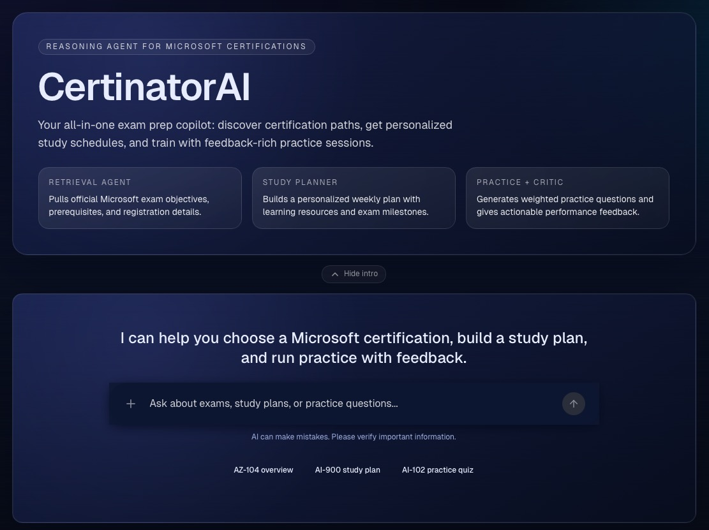

# Certinator AI

<div align="center">

</div>

---
Certinator AI is a multi-agent system that assists students in preparing for Microsoft certification exams. Built on the **[Microsoft Agent Framework (MAF)](https://github.com/microsoft/agent-framework)**, it uses a graph-based workflow engine with 6 specialized agents, human-in-the-loop interactions, and critic-validated outputs.

> [!NOTE]
> Certinator AI is an open-source project developed for the [Agents League](https://github.com/microsoft/agentsleague), competing in the [Reasoning Agents track](https://github.com/microsoft/agentsleague/tree/main/starter-kits/2-reasoning-agents).

> [!TIP]
> For a deep dive into the system design, see [ARCHITECTURE.md](ARCHITECTURE.md).

---

## Table of Contents

- [Features](#-features)
- [Prerequisites](#prerequisites)
- [Quick Start](#-quick-start-choose-one)
- [Manual Environment Setup](#%EF%B8%8F-manual-environment-setup)
- [Access the Application](#-access-the-application)
- [Multi-Agent Workflow](#-multi-agent-workflow)
- [LLM Provider Options](#-llm-provider-options)
- [Running Tests](#-running-tests)
- [Running Evaluations](#-running-evaluations)
- [Debugging](#-debugging)
- [Project Structure](#-project-structure)
- [Contributing](#contributing)
- [Troubleshooting](#troubleshooting)

---

## ✨ Features

- **Certification Information Retrieval** — Exam objectives, prerequisites, format, pricing, and recent syllabus changes, sourced from Microsoft Learn via MCP.
- **Personalized Study Plan Generation** — Week-by-week schedules built from real Microsoft Learn modules, computed with deterministic scheduling logic and formatted by LLM.
- **Practice Question Generation** — Multiple-choice quizzes with per-topic scoring, explanations, and weak-area identification.
- **Critic Validation Loop** — Every specialist output is reviewed by a critic agent for accuracy, completeness, and safety before reaching the user.
- **Human-in-the-Loop (HITL)** — The system asks for confirmation at key decision points (e.g., "Want practice questions after your study plan?").
- **Cross-Route Flows** — Failed quizzes can trigger targeted study plans; completed study plans can offer practice questions.

---

## Prerequisites

### Required Accounts

You need **one** of the following LLM providers:

| Provider | Account Required | Auth Method |
|----------|-----------------|-------------|
| **Azure AI Foundry** (default) | [Azure subscription](https://aka.ms/azure-free-account) | `az login` (Azure CLI) |
| **GitHub Models** | [GitHub account](https://github.com) | `GITHUB_TOKEN` env var |
| **FoundryLocal** | None (runs locally) | None |

> [!WARNING]
> **GitHub Models** and **FoundryLocal** providers are in beta and not fully tested. The primary tested provider is **Azure AI Foundry**. Contributions to improve the other providers are welcome!

### Required Tools

- **Python 3.10+** — [python.org/downloads](https://python.org/downloads)
- **Node.js 20.9+** and **pnpm** — [nodejs.org](https://nodejs.org/) / [pnpm.io](https://pnpm.io/installation)

> [!IMPORTANT]
> If using Azure AI Foundry, an Azure subscription is required. A **free trial** provides $200 credit for 30 days. Check the [Azure pricing calculator](https://azure.microsoft.com/pricing/calculator/) to estimate costs.

---

## 🚀 Quick Start (Choose One)

### Option 1: Command Line (Recommended)

```bash
# 1. Clone and enter the repo
git clone https://github.com/fernandosalomao/certinator-ai.git
cd certinator-ai

# 2. Configure environment
cp .env.sample .env
# Edit .env — set LLM_PROVIDER and LLM_ENDPOINT (see .env.sample for details)

# 3. Install all dependencies
make install

# 4. Start both backend + frontend
make dev
```

**Press `Ctrl+C` to stop both services.**

Other useful commands:

| Command | Description |
|---------|-------------|
| `make help` | Show all available commands |
| `make stop` | Force stop all processes |
| `make logs` | Tail backend logs |
| `make test` | Run unit tests |
| `make eval` | Run full evaluation pipeline |
| `make clean` | Remove `.venv` and `node_modules` |

### Option 2: VS Code Tasks

1. Open the project in VS Code
2. Press `Ctrl+Shift+P` → **Tasks: Run Task**
3. Select **🚀 Start Certinator (Full App)**

**To stop:** Run task **⏹️ Stop All**

### Option 3: Dev Container (GitHub Codespaces / Docker)

1. Open in GitHub Codespaces or VS Code with the Dev Containers extension
2. Wait for automatic setup (Python venv + pnpm install)
3. Edit `.env` with your provider credentials
4. Run `make dev` or use VS Code task **🚀 Start Certinator**

> [!TIP]
> The dev container automatically forwards ports 3000 (frontend) and 8000 (backend).

---

## 🛠️ Manual Environment Setup

<details>
<summary>Click to expand manual setup instructions</summary>

### Step 1: Clone the Repository

```bash
git clone https://github.com/fernandosalomao/certinator-ai.git
cd certinator-ai
```

### Step 2: Install Backend Dependencies

```bash
python3 -m venv .venv
source .venv/bin/activate  # On Windows: .venv\Scripts\activate
pip install -r requirements.txt
```

### Step 3: Install Frontend Dependencies

```bash
cd frontend
pnpm install
cd ..
```

### Step 4: Configure Environment

Copy `.env.sample` to `.env` and fill in the values:

```bash
cp .env.sample .env
```

At a minimum, set the LLM provider and endpoint:

```env
# Choose your provider: "azure" (default), "github", or "local"
LLM_PROVIDER=azure

# Azure AI Foundry project endpoint (required for azure provider)
# Find it in AI Foundry portal: Project settings → Project properties
LLM_ENDPOINT=https://<your-project>.services.ai.azure.com/api/projects/<project-id>

# Default model used by all agents (override per-agent in .env.sample)
LLM_MODEL_DEFAULT=gpt-4.1
```

> [!WARNING]
> Never commit your `.env` file to GitHub! It's already in `.gitignore`.

> [!TIP]
> **Finding your Azure AI Foundry endpoint:**
> 1. Go to [Microsoft Foundry Portal](https://ai.azure.com)
> 2. Create or select your **AI Project**
> 3. Go to **Project settings** (gear icon) → **Project properties**
> 4. Copy the **Project connection string**

See [`.env.sample`](.env.sample) for the full list of configuration options, including per-agent model overrides and rate limiting.

### Step 5: Run Services Separately

**Backend:**

```bash
source .venv/bin/activate
python src/app.py --agui
```

**Frontend (in another terminal):**

```bash
cd frontend
pnpm dev
```

</details>

---

## 🌐 Access the Application

Once running:

- **Frontend UI:** http://localhost:3000
- **Backend API:** http://localhost:8000

> Ports are configurable via `AGUI_HOST` / `AGUI_PORT` in your `.env` file.

---

## 🤖 Multi-Agent Workflow

The app runs a **graph-based multi-agent workflow** orchestrating 6 specialized agents:

| Agent | Purpose |
|-------|---------|
| **CoordinatorAgent** | Classifies user intent and routes to the right specialist |
| **CertificationInfoAgent** | Retrieves certification details via Microsoft Learn MCP |
| **LearningPathFetcherAgent** | Fetches exam topics, weights, and learning paths from MCP + Catalog API |
| **StudyPlanGeneratorAgent** | Generates week-by-week study schedules (deterministic math + LLM formatting) |
| **PracticeQuestionsAgent** | Creates quizzes, scores answers, generates feedback reports |
| **CriticAgent** | Validates specialist outputs for accuracy, completeness, and safety |

Every specialist output passes through the **CriticAgent** before reaching the user. If the critic finds issues, it sends a revision request back to the specialist (up to 2 iterations).

For the full workflow graph and routing logic, see [ARCHITECTURE.md](ARCHITECTURE.md).

### Example Queries to Try

- **Certification info**: "Tell me about the AZ-104 certification and its prerequisites"
- **Study planning**: "Create a 6-week study plan for AZ-305. I can study 2 hours per day."
- **Practice questions**: "Give me 10 practice questions for AZ-400"

---

## 🔧 LLM Provider Options

Certinator AI supports three LLM backends. Set `LLM_PROVIDER` in your `.env`:

| Provider | `LLM_PROVIDER` | Requirements | Default Model |
|----------|----------------|--------------|---------------|
| **Azure AI Foundry** | `azure` | `LLM_ENDPOINT` + `az login` | `gpt-4.1` |
| **GitHub Models** | `github` | `GITHUB_TOKEN` | `openai/gpt-4o` |
| **FoundryLocal** | `local` | [Foundry Local CLI](https://github.com/microsoft/foundry-local) installed | `qwen2.5-14b` |

Each agent can use a different model via per-agent environment variables (e.g., `LLM_MODEL_COORDINATOR`, `LLM_MODEL_CRITIC`). See [`.env.sample`](.env.sample) for details.

---

## 🧪 Running Tests

```bash
# Run all unit tests
make test

# Or directly with pytest
.venv/bin/python -m pytest tests/ -v
```

Tests cover safety filters, rate limiting, scheduling models, health endpoints, evaluation infrastructure, and LLM output normalization.

---

## 📊 Running Evaluations

Certinator AI includes a comprehensive evaluation pipeline with both custom evaluators and Azure AI SDK built-in evaluators.

```bash
# Run the full evaluation pipeline (custom + SDK built-in evaluators)
make eval

# Run only custom evaluators (no Azure AI SDK / LLM dependency)
make eval-custom
```

**Custom evaluators** (`evaluations/evaluators/`):

| Evaluator | What it measures |
|-----------|-----------------|
| `routing_accuracy` | Coordinator routes queries to the correct specialist |
| `quiz_quality` | Practice questions have valid structure, options, and topic coverage |
| `study_plan_feasibility` | Study plans respect time constraints and include real modules |
| `exam_content_accuracy` | Certification info matches golden dataset |
| `groundedness` | Outputs are grounded in source material |
| `critic_calibration` | Critic precision, recall, F1 — measures the quality gate itself |
| `content_safety` | Outputs are free from harmful content |

Results are saved to `evaluations/results/` as JSON. Datasets are in `evaluations/datasets/` (JSONL format).

---

## 🐞 Debugging

### VS Code (Recommended)

1. Press `Ctrl+Shift+P` → **Tasks: Run Task**
2. Select **Run Backend Server (Debug)** — starts the backend with `debugpy` attached
3. Attach VS Code's Python debugger to port `5679`
4. Set breakpoints in any `src/` file

For full-stack debugging, use the **Start Full Stack (Debug)** task which launches both backend (with debugpy) and frontend in parallel.

### OpenTelemetry Tracing

The backend emits OpenTelemetry traces via gRPC (port 4317). Configure in `.env`:

```env
OTEL_SERVICE_NAME=certinator-ai
ENABLE_INSTRUMENTATION=true
ENABLE_SENSITIVE_DATA=true  # Capture prompts and completions
```

Traces are viewable in the **AI Toolkit** extension's trace viewer in VS Code, or in the **Aspire Dashboard** (see below).

### Aspire Dashboard

For local development, you can use the [Aspire Dashboard](https://learn.microsoft.com/dotnet/aspire/fundamentals/dashboard/standalone) to visualize traces, logs, and metrics. It runs locally via Docker:

```bash
docker run --rm -it -d \
    -p 18888:18888 \
    -p 4317:18889 \
    --name aspire-dashboard \
    mcr.microsoft.com/dotnet/aspire-dashboard:latest
```

Then set the OTLP endpoint in your `.env`:

```env
OTEL_EXPORTER_OTLP_ENDPOINT=http://localhost:4317
```

Navigate to http://localhost:18888 to explore your traces. See the [Aspire Dashboard exploration guide](https://learn.microsoft.com/dotnet/aspire/fundamentals/dashboard/explore) for more details.

---

## 📁 Project Structure

```
certinator-ai/
├── src/                          # Backend (Python — Microsoft Agent Framework)
│   ├── app.py                    # Entrypoint: FastAPI + Uvicorn AG-UI server
│   ├── workflow.py               # WorkflowBuilder graph wiring (6 agents, 9 executors)
│   ├── config.py                 # Centralised configuration from env vars
│   ├── safety.py                 # Regex-based input safety filters
│   ├── rate_limiter.py           # Per-session and per-IP rate limiting middleware
│   ├── health.py                 # Health check endpoints
│   ├── metrics.py                # Custom OpenTelemetry metrics
│   ├── orchestrators.py          # Custom MAF orchestrators (HITL, state sync)
│   ├── agents/                   # Agent factory functions (one per specialist)
│   ├── executors/                # Workflow nodes (stateless, typed message dispatch)
│   │   └── models/               # Pydantic models for inter-executor messages
│   ├── tools/                    # MCP tools, MS Learn Catalog API, scheduling engine
│   └── utils/                    # Shared utilities
├── frontend/                     # Next.js + CopilotKit v2 + Tailwind CSS
│   ├── app/                      # App Router pages, API routes, components, hooks
│   └── package.json              # Dependencies (Next.js 16, React 19, CopilotKit)
├── evaluations/                  # Evaluation pipeline
│   ├── evaluation.py             # Evaluation runner
│   ├── evaluators/               # Custom evaluator implementations
│   ├── datasets/                 # JSONL test datasets
│   └── results/                  # Evaluation run outputs (JSON)
├── tests/                        # Unit tests (pytest)
├── .devcontainer/                # Dev Container config (Codespaces / Docker)
├── .env.sample                   # Environment variable template
├── ARCHITECTURE.md               # System architecture documentation
├── PROJECT.md                    # Project vision and feature descriptions
├── Makefile                      # Development commands (install, dev, test, eval)
└── requirements.txt              # Python dependencies
```

---

## Contributing

Feel free to submit issues and enhancement requests!

## Troubleshooting

### Limitations and Known Issues

- The primary tested LLM provider is `azure`. The `github` and `local` providers are in beta and may have issues. Contributions to improve them are welcome!
- Microsoft Learn Catalog API does not map exams and learning paths as cleanly as we'd like. Some workarounds are in place but may not cover all edge cases.

